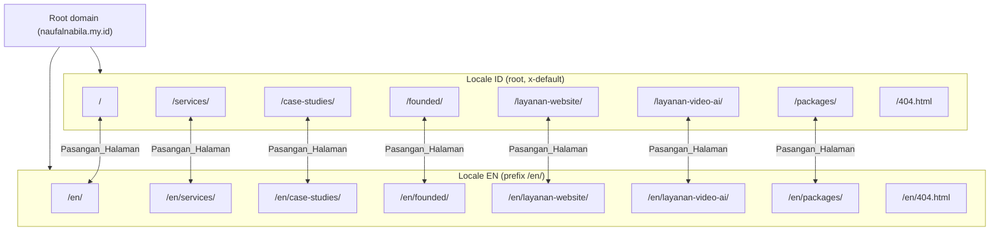
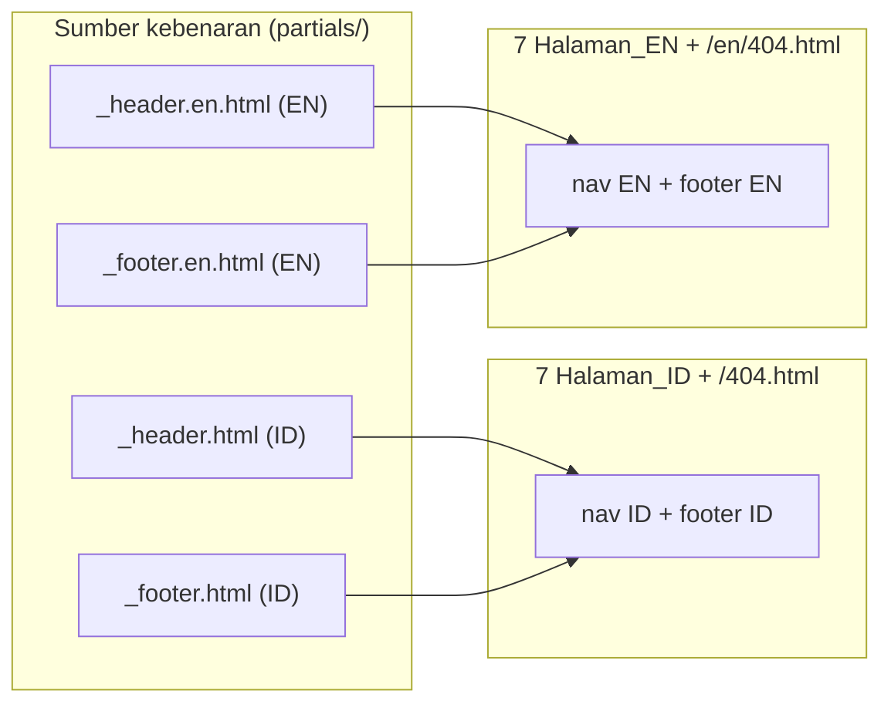
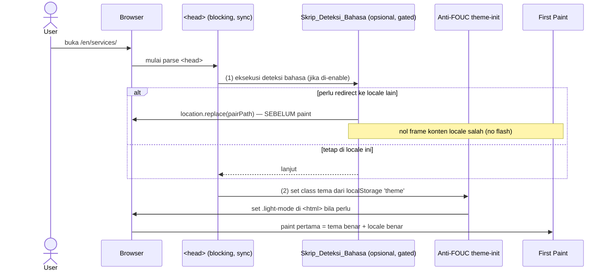
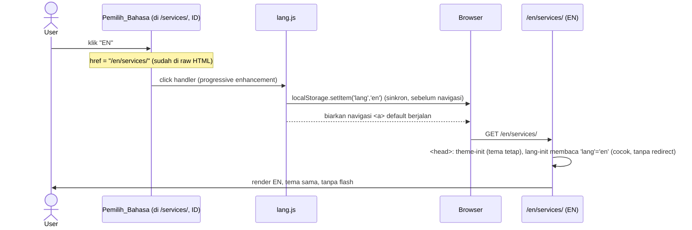

# Design Document: Bilingual ID/EN

## Overview

Fitur ini menjadikan situs portofolio `naufalnabila.my.id` **bilingual** — Bahasa Indonesia (ID) dan Bahasa Inggris (EN) — di atas arsitektur **multi-page statis** yang sudah ada. Setiap halaman konten kini punya dua versi: versi ID di root (`/`, `/services/`, …) dan versi EN di bawah prefix `/en/` (`/en/`, `/en/services/`, …). Total **16 dokumen HTML**: 7 halaman konten × 2 bahasa + halaman 404 × 2 bahasa.

Tantangan utamanya **bukan** menerjemahkan copy — itu mekanis. Tantangan utamanya adalah menambahkan dimensi bahasa **tanpa merusak apa pun yang sudah berjalan**: situs harus tetap 100% statis (HTML + CSS modular + JS vanilla, tanpa bundler/SSR), SEO existing tidak boleh turun (URL ID di root tidak berubah, ter-index seperti apa adanya), dan seluruh perilaku existing (tema + anti-FOUC, active-nav, hamburger mobile, reveal) harus identik di kedua bahasa **dan** saat berpindah bahasa. Selain itu fitur ini menambahkan permukaan SEO baru yang harus presisi: `lang`, `hreflang` (id/en/x-default), canonical per-locale, Open Graph per-locale, dan sitemap bilingual dengan `xhtml:link` alternates.

Keputusan arsitektur inti sudah dikonfirmasi user (A1–A4) dan menjadi fondasi desain ini:

- **A1 — ID default di root, EN di `/en/`.** `x-default` → ID. URL existing tidak berubah; kontinuitas SEO terjaga. Audiens utama pasar Indonesia (domain `.my.id`).
- **A2 — Slug EN = slug ID di bawah `/en/`** (path-prefix murni, bukan slug diterjemahkan). Relasi Pasangan_Halaman menjadi transformasi path yang sederhana dan dapat dibuktikan bijektif.
- **A3 — Terjemahan = file HTML statis terpisah per bahasa + partial shell per-locale.** Tidak ada terjemahan runtime JS. Auto-redirect deteksi bahasa **opsional** (gated), aman untuk crawler.
- **A4 — ID jadi canonical di root.** Copy English yang kini ada di root diterjemahkan ke ID; copy English existing menjadi basis `/en/`. Dua halaman layanan (kini ID) mendapat padanan EN.

Pendekatan ini melanjutkan strategi fitur **Multi-Page Restructure**: berbagi shell lewat **duplikasi markup** (sumber kebenaran di `partials/`) dengan **build script opsional tanpa dependensi** (`tools/build-pages.mjs`) sebagai jalur DRY, plus harness uji enumeratif/property-based (`tests/`, `fast-check` + `jsdom`) atas himpunan halaman yang tertutup. Tone mengikuti `multi-page-restructure/design.md`: _operator-grade_, SEO-first, static-first.

## Goals & Non-Goals

**Goals**

- Setiap halaman konten tersedia di dua bahasa: ID di root, EN di `/en/`, dengan clean URL berbasis folder.
- Relasi Pasangan_Halaman bijektif ID↔EN melalui penambahan/penghapusan prefix `/en/` yang murni algoritmik.
- Pemilih_Bahasa (language switcher) di `.nav-right`, raw HTML `<a href>` (no-JS fallback), indikator locale aktif, aksesibel, berfungsi di hamburger mobile.
- Persistensi pilihan bahasa ke `localStorage` (`lang`), plus Skrip_Deteksi_Bahasa inline opsional anti-FOUC dengan guard anti-loop.
- SEO bilingual presisi: `lang`, `hreflang` (id/en/x-default self-referencing absolute https), canonical self per-locale, `og:locale` + `og:locale:alternate`, title/description per bahasa.
- `sitemap.xml` bilingual dengan `xhtml:link` alternates per `<url>`; `robots.txt` tetap allow.
- Penyimpanan terjemahan static-first: file HTML per bahasa di folder `en/`, partial shell per-locale, `build-pages.mjs` diperluas jadi language-aware.
- Pelestarian penuh perilaku existing (tema/anti-FOUC, active-nav, hamburger, reveal, toggle khusus halaman) di kedua bahasa.
- Perluasan fixtures uji `PAGES` → `PAGES_BILINGUAL` (16 entri) agar invarian bilingual diuji enumeratif.

**Non-Goals**

- Menerjemahkan slug URL (mis. `/en/website-service/`). Ditunda; slug EN = slug ID.
- Memperkenalkan framework, bundler, SPA router, i18n runtime, atau backend.
- Mengubah desain visual / layout (selain menambah Pemilih_Bahasa di nav).
- Menambah bahasa ketiga (arsitektur tetap memungkinkan, tetapi di luar scope).
- Mengubah harga / nilai numerik antar bahasa (harus identik antar Pasangan_Halaman).

## Architecture

### High-Level: Struktur Folder & Skema URL Bilingual

ID disajikan di root (tak berubah dari struktur existing). EN adalah cerminan persis di bawah folder `en/`. Aset tetap satu salinan di `/assets/...` (root-relative), dibagikan kedua bahasa.

```
portofolio/
├── index.html                       → /                       (ID, Home)
├── 404.html                         → /404.html               (ID, 404)
├── services/index.html              → /services/              (ID)
├── case-studies/index.html          → /case-studies/          (ID)
├── founded/index.html               → /founded/               (ID)
├── layanan-website/index.html       → /layanan-website/       (ID)
├── layanan-video-ai/index.html      → /layanan-video-ai/      (ID)
├── packages/index.html              → /packages/              (ID)
│
├── en/
│   ├── index.html                   → /en/                    (EN, Home)
│   ├── 404.html                     → /en/404.html            (EN, 404)
│   ├── services/index.html          → /en/services/           (EN)
│   ├── case-studies/index.html      → /en/case-studies/       (EN)
│   ├── founded/index.html           → /en/founded/            (EN)
│   ├── layanan-website/index.html   → /en/layanan-website/    (EN)
│   ├── layanan-video-ai/index.html  → /en/layanan-video-ai/   (EN)
│   └── packages/index.html          → /en/packages/           (EN)
│
├── partials/                        (sumber kebenaran shell, tidak dideploy-runtime)
│   ├── _header.html                 (nav ID)
│   ├── _footer.html                 (footer ID)
│   ├── _header.en.html              (nav EN)        ← BARU
│   ├── _footer.en.html              (footer EN)     ← BARU
│   └── _theme-init.html             (anti-FOUC, language-agnostic)
│
├── tools/build-pages.mjs            (opsional, diperluas jadi language-aware)
├── sitemap.xml                      (14 URL konten + xhtml:link alternates)
├── robots.txt                       (allow; sitemap pointer)
└── assets/ ...                      (SATU salinan, dibagikan kedua bahasa)
```



### Peta Pasangan_Halaman ID↔EN

Relasi bijektif. Setiap baris adalah satu pasangan yang ditautkan oleh Pemilih_Bahasa, `hreflang`, dan entri sitemap. Halaman 404 berpasangan tetapi **tidak** masuk sitemap dan ber-`noindex`.

| #   | Slug               | Halaman_ID (root)    | Halaman_EN (`/en/`)     | Di sitemap?  |
| --- | ------------------ | -------------------- | ----------------------- | ------------ |
| 1   | `` (home)          | `/`                  | `/en/`                  | ✅           |
| 2   | `services`         | `/services/`         | `/en/services/`         | ✅           |
| 3   | `case-studies`     | `/case-studies/`     | `/en/case-studies/`     | ✅           |
| 4   | `founded`          | `/founded/`          | `/en/founded/`          | ✅           |
| 5   | `layanan-website`  | `/layanan-website/`  | `/en/layanan-website/`  | ✅           |
| 6   | `layanan-video-ai` | `/layanan-video-ai/` | `/en/layanan-video-ai/` | ✅           |
| 7   | `packages`         | `/packages/`         | `/en/packages/`         | ✅           |
| 8   | `404`              | `/404.html`          | `/en/404.html`          | ❌ (noindex) |

Relasi ini **murni transformasi path** (asumsi A2): `pairPath("/services/") = "/en/services/"` dan `pairPath("/en/services/") = "/services/"`. Tidak ada tabel lookup terjemahan slug. Konsekuensinya, Pasangan_Halaman dapat dihitung dari path saja dan dibuktikan bijektif (lihat Algoritma `pairPath` + Property 1).

### Arsitektur Shared Shell Per-Locale

Pada fitur multi-page, shell (nav + footer) identik byte-per-byte di semua halaman, bersumber dari `partials/_header.html` + `partials/_footer.html`. Fitur bilingual **menggandakan sumber kebenaran per-locale**:



Perbedaan shell ID vs EN, dan invarian yang harus dijaga:

| Aspek                            | Shell ID             | Shell EN                     | Invarian                                    |
| -------------------------------- | -------------------- | ---------------------------- | ------------------------------------------- |
| Teks label nav/footer            | Bahasa Indonesia     | Bahasa Inggris               | Diterjemahkan penuh (Req 6.2)               |
| href Link_Internal               | root (`/services/`)  | ber-prefix (`/en/services/`) | Selalu intra-locale (Req 7.3, PROP-7)       |
| Pemilih_Bahasa: indikator aktif  | `id`                 | `en`                         | Tepat satu aktif = locale halaman (PROP-6)  |
| Pemilih_Bahasa: href target      | `/en/{slug}` (ke EN) | `/{slug}` (ke ID)            | = `pairPath(halaman)` (PROP-2)              |
| Struktur DOM (kelas, id, urutan) | identik              | identik                      | Konsisten antar halaman se-locale (Req 7.2) |

Konsekuensi penting: **Pemilih_Bahasa adalah satu-satunya elemen yang href-nya berbeda per halaman dalam satu locale** (karena menunjuk ke pasangan halaman _saat ini_). Oleh karena itu, uji konsistensi shell (Property 11 versi bilingual) harus menetralkan href Pemilih_Bahasa selain menetralkan active-state — lihat Data Models → Aturan Normalisasi Shell.

### Strategi Routing: Path-Prefix Statis Murni

Tidak ada server-side routing. Static host melayani `/en/services/` dari file `en/services/index.html` via konvensi directory-index yang sama dengan ID (`/services/` → `services/index.html`). Yang dibutuhkan dari host hanyalah kemampuan yang **sudah** dipakai fitur multi-page: serve `index.html` untuk request direktori. Prefix `/en/` hanyalah folder biasa; tidak ada rewrite/redirect server.

Implikasi:

- **Navigasi default tetap intra-locale.** Karena shell EN memakai href ber-prefix dan shell ID memakai href root, mengklik link nav/footer biasa tidak pernah keluar dari locale halaman (Req 1.6, 7.3). Berpindah locale **hanya** lewat Pemilih_Bahasa.
- **404 per-locale.** Path tak dikenal di bawah `/en/` → host serve `/en/404.html`; lainnya → `/404.html`. Ini adalah konfigurasi host (mis. `404.html` per-folder atau aturan host), bukan kode runtime. Dicatat sebagai dependensi host di bagian Dependencies.

### Anti-FOUC, Tema, dan Keputusan Bahasa di `<head>`

Urutan eksekusi sinkron di `<head>` setiap halaman, **sebelum** paint pertama, harus dijaga ketat agar tidak ada flash (tema maupun bahasa):



**Urutan kritis:** Skrip_Deteksi_Bahasa harus berjalan **sebelum** theme-init (atau setidaknya keduanya sinkron sebelum CSS), karena bila terjadi redirect bahasa, halaman tujuan akan menjalankan ulang theme-init-nya sendiri — jadi tidak ada gunanya men-set tema lalu langsung me-redirect. Menempatkan deteksi bahasa paling atas meminimalkan kerja yang terbuang. Keduanya tetap inline & sinkron; tidak boleh `defer`/eksternal.

**Gating auto-redirect (Req 3.3, 3.7).** Skrip_Deteksi_Bahasa default **non-aktif** (flag konstan `LANG_AUTO_REDIRECT = false` di dalam snippet inline). Saat non-aktif, snippet ini menjadi no-op total: setiap halaman tampil pada locale URL-nya. Saat di-enable, ia menerapkan presedensi dan guard anti-loop (lihat Algoritma `detectAndRedirect`). Pemilih_Bahasa dan persistensi `localStorage` tetap berfungsi tanpa bergantung pada auto-redirect.

### Sequence: Berpindah Bahasa via Pemilih_Bahasa



Catatan: bahkan tanpa JS, klik Pemilih_Bahasa tetap menavigasi ke `/en/services/` karena ia adalah `<a href>` murni (Req 2.4). `lang.js` hanya menambah persistensi (menyimpan `lang` sebelum unload) sebagai progressive enhancement.

## Components and Interfaces

### Komponen Baru & yang Berubah

| Komponen                                                       | Lokasi                                   | Tujuan                                                                    | Status                                     |
| -------------------------------------------------------------- | ---------------------------------------- | ------------------------------------------------------------------------- | ------------------------------------------ |
| Pemilih_Bahasa (markup)                                        | `partials/_header.*.html` → tiap halaman | Switch ID↔EN, href ke Pasangan_Halaman, indikator aktif                   | **Baru**                                   |
| `lang.js` (Modul_Bahasa)                                       | `/assets/js/lang.js`                     | Persist pilihan ke `localStorage 'lang'`, tandai aktif (a11y), wire click | **Baru**                                   |
| Skrip_Deteksi_Bahasa                                           | inline `<head>` (opsional)               | Redirect ke locale tersimpan/terdeteksi sebelum paint, gated + anti-loop  | **Baru (gated)**                           |
| `_header.en.html`, `_footer.en.html`                           | `partials/`                              | Sumber kebenaran shell EN                                                 | **Baru**                                   |
| `_header.html`, `_footer.html`                                 | `partials/`                              | Shell ID + tambah Pemilih_Bahasa                                          | **Diubah**                                 |
| `build-pages.mjs`                                              | `tools/`                                 | Language-aware: rakit ID dari partial ID, EN dari partial EN              | **Diubah**                                 |
| `sitemap.xml`                                                  | root                                     | 14 URL + `xhtml:link` alternates per `<url>`                              | **Diubah**                                 |
| `theme.js`, `nav.js`, `reveal.js`, `toggles.js`, `services.js` | `/assets/js/`                            | Perilaku existing                                                         | **Tidak berubah** (dibagikan kedua locale) |
| `tests/fixtures/pages.mjs`                                     | `tests/`                                 | `PAGES` → `PAGES_BILINGUAL` (16) + `pairPath`                             | **Diubah**                                 |

### Interface — Modul_Bahasa (`lang.js`)

`lang.js` di-load `defer` di semua halaman (core JS bilingual). Ia mem-progressive-enhance Pemilih_Bahasa dan mengekspos util untuk testing, mengikuti pola `window.__nav`.

```javascript
/**
 * Public surface exposed for tests & inline scripts.
 * @typedef {Object} LangModule
 * @property {(path: string) => string} pairPath   - ID<->EN path mapping (pure)
 * @property {(path: string) => ("id"|"en")} localeOf - locale implied by a path
 * @property {() => ("id"|"en"|null)} readStoredLang - validated localStorage 'lang'
 * @property {(locale: "id"|"en") => void} storeLang - persist explicit choice
 * @property {(navigator: {language?: string}) => ("id"|"en")} detectFromNavigator
 */
// window.__lang = { pairPath, localeOf, readStoredLang, storeLang, detectFromNavigator }
```

### Interface — Pemilih_Bahasa (data contract markup)

Pemilih_Bahasa adalah fragmen statis di dalam `.nav-right`, sebelum tombol theme toggle. Dua anchor (ID, EN); satu menandai locale aktif. Pada shell per-locale, **href dan indikator aktif berbeda**, sisanya identik.

```html
<!-- Kontrak markup. {SELF}=path locale halaman, {PAIR}=pairPath({SELF}) -->
<div
  class="lang-switcher"
  role="group"
  aria-label="Pilih bahasa / Select language"
>
  <a
    class="lang-option"
    hreflang="id"
    href="{ID_PATH}"
    aria-current="true|—"
    data-lang="id"
    >ID</a
  >
  <a
    class="lang-option"
    hreflang="en"
    href="{EN_PATH}"
    aria-current="true|—"
    data-lang="en"
    >EN</a
  >
</div>
```

- Pada Halaman_ID: `{ID_PATH}` = path halaman itu sendiri; `{EN_PATH}` = `pairPath(self)`; anchor `id` menandai `aria-current="true"`.
- Pada Halaman_EN: kebalikannya; anchor `en` menandai `aria-current="true"`.
- Kedua href adalah path root-relative yang ada di `PAGES_BILINGUAL`; tidak ada `/en/en/`. Berfungsi penuh tanpa JS (Req 2.4).

### Interface — Konfigurasi Halaman Bilingual (data contract per-page `<head>`)

Memperluas `PageMeta` existing dengan dimensi locale & SEO bilingual. Bila build script dipakai, ini input nyata; bila duplikasi manual, ini checklist yang harus diisi per halaman.

```javascript
/**
 * @typedef {Object} BilingualPageMeta
 * @property {""|"services"|"case-studies"|"founded"|"layanan-website"|"layanan-video-ai"|"packages"|"404"} slug
 * @property {"id"|"en"} locale          - locale halaman ini
 * @property {string} path               - URL kanonik locale ini, mis. "/en/services/"
 * @property {string} pairPath           - URL Pasangan_Halaman, mis. "/services/"
 * @property {string} file               - file relatif root, mis. "en/services/index.html"
 * @property {string} canonical          - absolut self, "https://naufalnabila.my.id" + path
 * @property {string} hrefId             - absolut URL Halaman_ID (untuk hreflang=id)
 * @property {string} hrefEn             - absolut URL Halaman_EN (untuk hreflang=en)
 * @property {string} hrefXDefault       - = hrefId (x-default → ID)
 * @property {string} title              - <title> dalam locale (10–70 char)
 * @property {string} description        - meta description dalam locale (50–160 char)
 * @property {"id_ID"|"en_US"} ogLocale  - og:locale
 * @property {"id_ID"|"en_US"} ogLocaleAlt - og:locale:alternate (lawannya)
 * @property {string[]} extraCss         - mis. ["services-commercial"]
 * @property {string[]} extraJs          - mis. ["toggles"] atau ["services"]
 * @property {("id"|"en")} jsonLdLang    - inLanguage utk JSON-LD Service (atau null)
 * @property {Object|null} jsonLd        - blok Service terlokalisasi (atau null)
 */
```

### Daftar Aset Wajib per Halaman (kedua locale identik)

Aset JS/CSS **dibagikan**; locale tidak mengubah daftar aset. `lang.js` menjadi core JS baru di **semua** halaman.

| Halaman (×2 locale) | extraCss              | extraJs    | jsonLd                                        |
| ------------------- | --------------------- | ---------- | --------------------------------------------- |
| Home                | —                     | —          | —                                             |
| Services            | —                     | —          | —                                             |
| Case Studies        | —                     | `toggles`  | —                                             |
| Founded             | —                     | `toggles`  | —                                             |
| Layanan Website     | `services-commercial` | `services` | `Service` (Website), `inLanguage` per locale  |
| Layanan Video AI    | `services-commercial` | `services` | `Service` (Video AI), `inLanguage` per locale |
| Packages            | —                     | —          | —                                             |

Core JS semua halaman: `theme, nav, reveal, lang, main`. (Penambahan `lang` adalah satu-satunya perubahan daftar core.)

## Data Models

### `pairPath` — Pemetaan Pasangan_Halaman (algoritmik)

Fungsi murni yang menambah/menghapus prefix `/en/`. Ini jantung relasi Pasangan_Halaman (Req 1.3) dan target Pemilih_Bahasa (Req 2.3).

```javascript
/**
 * Map a site path to its Pasangan_Halaman in the other locale.
 * Pure, total over canonical site paths; involutive: pairPath(pairPath(p)) === p.
 *
 * @param {string} path - canonical root-relative path, e.g. "/services/" or "/en/services/"
 * @returns {string} the paired path in the other locale
 */
function pairPath(path)
```

**Precondition:** `path` adalah path kanonik yang ada di `PAGES_BILINGUAL` (diawali `/`, bentuk folder berakhiran `/` atau `*.html` untuk 404).
**Postcondition:**

- Jika `path` diawali `/en/` (atau tepat `/en` → diperlakukan `/en/`): hasil = `path` tanpa prefix `/en` (mis. `/en/services/` → `/services/`, `/en/` → `/`, `/en/404.html` → `/404.html`).
- Selain itu: hasil = `/en` + `path` (mis. `/services/` → `/en/services/`, `/` → `/en/`, `/404.html` → `/en/404.html`).
- **Involutif:** `pairPath(pairPath(p)) === p` untuk semua path kanonik.
- Tidak pernah menghasilkan prefix ganda `/en/en/`.

### `localeOf` — Locale dari Path

```javascript
/**
 * Determine the locale a canonical path belongs to.
 * @param {string} path
 * @returns {"id"|"en"} "en" iff path is under the /en/ prefix, else "id"
 */
function localeOf(path)
```

**Postcondition:** `localeOf(p) === "en"` ⟺ `p === "/en"` atau `p` diawali `/en/`. Konsisten dengan `pairPath`: `localeOf(pairPath(p)) !== localeOf(p)`.

### `PAGES_BILINGUAL` — Fixture Kanonik (16 entri)

Perluasan `PAGES` existing. Sumber kebenaran tunggal untuk seluruh uji enumeratif bilingual. Diturunkan secara terprogram dari daftar slug + `pairPath` agar tidak mungkin tidak sinkron.

```javascript
// tests/fixtures/pages.mjs (perluasan)

/** Origin kanonik untuk semua URL absolut. */
export const ORIGIN = "https://naufalnabila.my.id";

/** 7 slug konten + slug 404 (urutan stabil untuk test determinisme). */
const CONTENT_SLUGS = [
  "",
  "services",
  "case-studies",
  "founded",
  "layanan-website",
  "layanan-video-ai",
  "packages",
];

/**
 * @typedef {Object} BiPage
 * @property {string} slug
 * @property {"id"|"en"} locale
 * @property {string} path      - canonical, e.g. "/en/services/"
 * @property {string} pairPath  - paired path, e.g. "/services/"
 * @property {string} file      - e.g. "en/services/index.html"
 * @property {boolean} indexable - false untuk 404
 */

// Dibangun dari CONTENT_SLUGS × {id, en} + 404 × {id, en} = 16 entri.
// ID:  path "/", "/services/", ...           file "index.html", "services/index.html", ...
// EN:  path "/en/", "/en/services/", ...      file "en/index.html", "en/services/index.html", ...
// 404: path "/404.html" & "/en/404.html"      indexable=false
export const PAGES_BILINGUAL = Object.freeze([
  /* 16 entri ter-generate, lihat Migration */
]);

/** 14 halaman konten indexable (PAGES_BILINGUAL tanpa dua 404). */
export const CONTENT_PAGES_BILINGUAL = Object.freeze(
  PAGES_BILINGUAL.filter((p) => p.indexable),
);

/** Pasangan ID↔EN: array of { id: BiPage, en: BiPage } untuk uji bijeksi. */
export const PAGE_PAIRS = Object.freeze(/* group berdasarkan slug */);
```

Struktur 16 entri (eksplisit untuk kejelasan):

| slug               | id.path → id.file                                    | en.path → en.file                                          |
| ------------------ | ---------------------------------------------------- | ---------------------------------------------------------- |
| ``                 | `/` → `index.html`                                   | `/en/` → `en/index.html`                                   |
| `services`         | `/services/` → `services/index.html`                 | `/en/services/` → `en/services/index.html`                 |
| `case-studies`     | `/case-studies/` → `case-studies/index.html`         | `/en/case-studies/` → `en/case-studies/index.html`         |
| `founded`          | `/founded/` → `founded/index.html`                   | `/en/founded/` → `en/founded/index.html`                   |
| `layanan-website`  | `/layanan-website/` → `layanan-website/index.html`   | `/en/layanan-website/` → `en/layanan-website/index.html`   |
| `layanan-video-ai` | `/layanan-video-ai/` → `layanan-video-ai/index.html` | `/en/layanan-video-ai/` → `en/layanan-video-ai/index.html` |
| `packages`         | `/packages/` → `packages/index.html`                 | `/en/packages/` → `en/packages/index.html`                 |
| `404`              | `/404.html` → `404.html`                             | `/en/404.html` → `en/404.html`                             |

### `NAV_ITEMS` Per-Locale

`NAV_ITEMS` existing menjadi fungsi locale → daftar item, di mana href ID di-prefix untuk EN. Label juga diterjemahkan.

```javascript
/**
 * Build the navigation definition for a locale.
 * EN hrefs are ID hrefs with the /en prefix; labels are localized.
 * @param {"id"|"en"} locale
 * @returns {ReadonlyArray<NavItem>}
 */
export function navItemsFor(locale)
```

Contoh hasil (disingkat):

| Item         | ID href / label                             | EN href / label                                |
| ------------ | ------------------------------------------- | ---------------------------------------------- |
| Services     | `/services/` "Layanan" _(catatan di bawah)_ | `/en/services/` "Services"                     |
| Process      | `/services/#process` "Proses"               | `/en/services/#process` "Process"              |
| Case Studies | `/case-studies/` "Studi Kasus"              | `/en/case-studies/` "Case Studies"             |
| Founded      | `/founded/` "Dirikan"                       | `/en/founded/` "Founded"                       |
| Layanan ▾    | `/layanan-website/` "Layanan"               | `/en/layanan-website/` "Services"              |
| → Website    | `/layanan-website/` "Website"               | `/en/layanan-website/` "Website"               |
| → Video AI   | `/layanan-video-ai/` "Video AI"             | `/en/layanan-video-ai/` "Video AI"             |
| Packages     | `/packages/` "Paket"                        | `/en/packages/` "Packages"                     |
| CTA          | `/packages/#contact` "Pesan Audit Sistem"   | `/en/packages/#contact` "Book a Systems Audit" |

> Catatan disambiguasi label: pada copy existing, item nav umum "Services" dan dropdown komersial "Layanan" berbeda peran. Penerjemahan label final ditetapkan saat implementasi konten (Req 6.2); yang mengikat secara arsitektur adalah href per-locale dan jumlah/strukturnya, bukan pilihan kata. Uji menegakkan href intra-locale dan struktur, bukan teks spesifik.

### Validation Rules (tambahan bilingual atas aturan existing)

| Aturan                       | Detail                                                                                                                                                       |
| ---------------------------- | ------------------------------------------------------------------------------------------------------------------------------------------------------------ |
| `<html lang>`                | Tepat satu, nilai = locale halaman (`id`/`en`), huruf kecil (Req 4.1, PROP-3)                                                                                |
| `hreflang` lengkap           | Tepat 3 `<link rel=alternate hreflang>`: `id`, `en`, `x-default`; absolut https; `href` ada di `PAGES_BILINGUAL`; self-referencing (Req 4.2, PROP-4)         |
| canonical self               | Absolut https, berakhiran `/`, = `ORIGIN + path` locale-nya = entri hreflang locale itu (Req 4.3, PROP-5)                                                    |
| `og:locale`                  | `id_ID`/`en_US` sesuai locale; `og:locale:alternate` = lawannya; `og:url` == canonical (Req 4.5)                                                             |
| title/description per-locale | title 10–70 char, description 50–160 char, non-kosong, unik dalam himpunan se-locale (Req 4.4)                                                               |
| Pemilih_Bahasa               | Tepat 1 per halaman di `.nav-right`; tepat 1 indikator aktif = locale halaman; href target = `pairPath(self)`; raw `<a>` (Req 2.1, 2.2, 2.4, PROP-2, PROP-6) |
| Link_Internal intra-locale   | Semua `<a href>` internal (selain Pemilih_Bahasa) → URL locale yang sama, ada di `PAGES_BILINGUAL`, tanpa `/en/en/` (Req 1.6, 7.3, 7.6, PROP-7)              |
| Shell konsisten se-locale    | nav & footer identik setelah normalisasi (active-state, href Pemilih_Bahasa, indentasi) antar halaman dalam locale yang sama (Req 7.2)                       |
| JSON-LD Service              | Tepat 1 `Service` di 4 halaman layanan; 0 di lainnya; `inLanguage` = locale; valid JSON.parse (Req 8.1–8.4, PROP-11)                                         |
| sitemap bilingual            | 14 `<loc>` konten (tanpa 404); per `<url>` tepat 3 `xhtml:link` (id/en/x-default); well-formed; namespace xhtml (Req 5.1, 5.2, 5.5, PROP-10)                 |
| Active nav per-locale        | Tepat 1 item top-level `aria-current="page"` untuk halaman konten; 0 untuk 404 (Req 10.2, PROP-12)                                                           |

### Aturan Normalisasi Shell (untuk uji konsistensi se-locale)

Uji konsistensi shell bilingual memperluas `normalizeShell` existing dengan satu netralisasi tambahan: **href Pemilih_Bahasa** (yang sah berbeda per halaman). Dinetralkan dengan urutan:

1. Buang `aria-current="page"` dan `aria-current="true"` (active-state runtime + indikator bahasa).
2. Buang token kelas `active`.
3. Pada elemen `.lang-switcher`, ganti nilai `href` setiap `.lang-option` dengan placeholder konstan (mis. `href="#"`), karena href ini per-halaman by design.
4. Trim spasi indentasi per baris.

Setelah normalisasi ini, shell harus identik byte-per-byte antar semua halaman **dalam locale yang sama**. Shell ID dan EN **tidak** dibandingkan satu sama lain (bahasanya beda).

## Correctness Properties

_Sebuah properti adalah karakteristik atau perilaku yang harus selalu benar di seluruh eksekusi valid sistem — pernyataan formal tentang apa yang harus dilakukan sistem. Properti menjembatani spesifikasi yang dapat dibaca manusia dengan jaminan korektnes yang dapat diverifikasi mesin._

Properti di bawah diturunkan dari prework atas acceptance criteria. Sebagian besar adalah **properti enumeratif** atas himpunan tertutup `PAGES_BILINGUAL` (16 entri) — tetap "property-style" (universal terhadap semua halaman) tetapi domainnya finit — dan sebagian adalah **property-based murni** atas fungsi (`pairPath`, `localeOf`, `detectFromNavigator`, resolusi presedensi, keputusan redirect) menggunakan `fast-check`. Acceptance criteria yang menilai kualitas bahasa terjemahan atau sifat arsitektur tidak dipetakan ke properti (ditangani review manual / smoke — lihat Testing Strategy).

Penomoran PROP-1..PROP-12 dipertahankan agar sejajar dengan Requirement 11 dan referensi `*(validates correctness property PROP-n)*` di requirements. Beberapa properti tambahan (PROP-13..PROP-19) menegakkan invarian struktural/SEO yang dirujuk requirement tetapi tidak diberi nomor PROP eksplisit.

### Property 1: PROP-1 — Pasangan_Halaman bijektif & involutif

_For any_ path kanonik `p` yang ada dalam `PAGES_BILINGUAL`, `pairPath(p)` menghasilkan path locale-lawan yang juga ada dalam `PAGES_BILINGUAL`, dengan `localeOf(pairPath(p)) ≠ localeOf(p)`, dan `pairPath(pairPath(p)) === p` (involutif) — sehingga relasi Pasangan_Halaman bijektif tanpa halaman yatim dan tanpa menghasilkan prefix ganda `/en/en/`.

**Validates: Requirements 1.3, 11.1**

### Property 2: PROP-2 — Pemilih_Bahasa menaut ke Pasangan_Halaman

_For any_ halaman `X` dalam `PAGES_BILINGUAL`, opsi Pemilih_Bahasa untuk locale-lawan memiliki `href` yang sama dengan `pairPath(X.path)` dan target tersebut ada dalam `PAGES_BILINGUAL`; opsi untuk locale halaman itu sendiri ber-`href` ke `X.path`.

**Validates: Requirements 2.3, 2.4, 11.2**

### Property 3: PROP-3 — `<html lang>` cocok locale halaman

_For any_ halaman dalam `PAGES_BILINGUAL`, elemen `<html>` memiliki tepat satu atribut `lang` yang nilainya (huruf kecil) sama persis dengan locale halaman (`"id"` untuk Halaman_ID, `"en"` untuk Halaman_EN).

**Validates: Requirements 4.1, 11.3**

### Property 4: PROP-4 — hreflang lengkap, self-referencing, resolvable

_For any_ halaman konten dalam `CONTENT_PAGES_BILINGUAL`, terdapat tepat tiga `<link rel="alternate" hreflang="…">` dengan nilai `id`, `en`, dan `x-default`, di mana `hreflang="id"` → URL Halaman_ID, `hreflang="en"` → URL Halaman_EN, `hreflang="x-default"` → URL Halaman_ID; setiap `href` adalah URL absolut `https` pada host `naufalnabila.my.id` yang menunjuk file dalam `PAGES_BILINGUAL`, dan himpunannya menyertakan rujukan-mandiri ke locale halaman itu.

**Validates: Requirements 4.2, 11.4**

### Property 5: PROP-5 — canonical = URL diri sendiri

_For any_ halaman konten dalam `CONTENT_PAGES_BILINGUAL`, terdapat tepat satu `link[rel=canonical]` yang nilainya sama dengan `ORIGIN + path` halaman itu (absolut `https`, berakhiran `/`), identik dengan entri `hreflang` locale halaman itu, dan bukan menunjuk ke pasangan bahasa lain.

**Validates: Requirements 4.3, 11.5**

### Property 6: PROP-6 — indikator bahasa aktif = locale halaman

_For any_ halaman dalam `PAGES_BILINGUAL`, Pemilih_Bahasa menandai tepat satu opsi sebagai aktif (`aria-current`), opsi tersebut adalah `data-lang` yang sama dengan locale halaman, dan opsi locale lainnya tidak ditandai aktif.

**Validates: Requirements 2.2, 11.6**

### Property 7: PROP-7 — seluruh Link_Internal intra-locale

_For any_ halaman dalam `PAGES_BILINGUAL` dan _for any_ `Link_Internal` pada halaman itu kecuali tautan Pemilih_Bahasa, `localeOf(normalizePath(href))` sama dengan locale halaman, `href` menunjuk ke URL yang ada dalam `PAGES_BILINGUAL`, dan tidak ada `href` yang mengandung prefix ganda `/en/en/`.

**Validates: Requirements 1.6, 7.3, 7.6, 11.7**

### Property 8: PROP-8 — persistensi pilihan bahasa

_For any_ locale `L ∈ {"id","en"}`, memanggil `storeLang(L)` lalu `readStoredLang()` mengembalikan `L`; dan _for any_ nilai tersimpan yang bukan `"id"`/`"en"` (kosong, rusak, tak dikenal), `readStoredLang()` mengembalikan `null` (diperlakukan sebagai tidak ada).

**Validates: Requirements 3.1, 3.2, 11.8**

### Property 9: PROP-9 — keputusan redirect aman (anti-loop, pre-paint, gated)

_For any_ kombinasi `(enabled, storedLang, currentPath, explicitChoice)`, fungsi keputusan `decideRedirect`:

- mengembalikan `null` (tanpa redirect) bila `enabled` salah, atau tidak ada `storedLang` valid tanpa deteksi navigator, atau locale tujuan sama dengan `localeOf(currentPath)`, atau ada pilihan eksplisit pada navigasi saat ini;
- bila mengembalikan target non-null, maka `target === pairPath(currentPath)` dan `target ≠ currentPath` (paling banyak satu redirect, tidak pernah ke URL yang sama → bebas loop), dan setelah berada di `target`, pemanggilan ulang mengembalikan `null` (idempoten).

**Validates: Requirements 3.3, 3.5, 11.9**

### Property 10: PROP-9 pendukung — resolusi presedensi & deteksi navigator

_For any_ `(storedLang, navigatorLanguage)`: resolusi locale mengikuti presedensi pilihan-eksplisit > stored-valid > navigator > default(ID); nilai `storedLang` selain `"id"`/`"en"` diabaikan. _For any_ string `navigatorLanguage`, `detectFromNavigator` mengembalikan `"en"` bila dan hanya bila string diawali `en` tanpa peka huruf besar/kecil (mis. `en`, `en-US`, `EN-GB`), dan `"id"` untuk lainnya termasuk string kosong/tak tersedia.

**Validates: Requirements 3.2, 3.4, 3.7**

### Property 11: PROP-10 — sitemap bilingual lengkap & konsisten

_For any_ `sitemap.xml` yang dihasilkan: himpunan `<loc>` sama persis dengan 14 URL halaman konten (7 ID + 7 EN), tanpa duplikat, tanpa kedua URL 404, masing-masing absolut `https` berakhiran `/` dan sama dengan `canonical` halaman bersangkutan; dan setiap `<url>` memuat tepat tiga `<xhtml:link rel="alternate" hreflang="…">` (`id`, `en`, `x-default`) yang `href`-nya identik antar kedua anggota Pasangan_Halaman dan cocok dengan `hreflang` yang dideklarasikan di halaman.

**Validates: Requirements 5.1, 5.2, 5.4, 11.10**

### Property 12: PROP-11 — JSON-LD Service tepat sasaran & valid

_For any_ halaman dalam `PAGES_BILINGUAL`: terdapat tepat satu blok JSON-LD bertipe `Service` pada keempat halaman layanan (`/layanan-website/`, `/en/layanan-website/`, `/layanan-video-ai/`, `/en/layanan-video-ai/`) dan nol pada halaman lain; setiap blok JSON-LD di setiap halaman `JSON.parse` sukses menjadi objek non-null; dan pada keempat halaman layanan, `Service.inLanguage` sama dengan locale halaman dan dengan `<html lang>`.

**Validates: Requirements 8.1, 8.3, 8.4, 11.11**

### Property 13: PROP-12 — active-nav tepat satu per halaman

_For any_ path halaman dalam `PAGES_BILINGUAL`, setelah `setActiveNav` dijalankan pada shell locale yang sesuai: jumlah anchor top-level dengan `aria-current="page"` sama dengan 1 untuk halaman konten dan 0 untuk halaman 404, dan anchor yang aktif (bila ada) ber-`normalizePath(href)` sama dengan `normalizePath(path)`.

**Validates: Requirements 10.2, 11.12**

### Property 14: integritas struktur `PAGES_BILINGUAL`

_For any_ anggota `PAGES_BILINGUAL`: himpunan berisi tepat 16 entri (14 indexable + 2 halaman 404), setiap entri memetakan ke tepat satu file yang ada dan path-nya berbentuk kanonik (konten berakhiran `/`, 404 berakhiran `.html`) yang strukturnya mencerminkan skema URL (`/en/{slug}/` ↔ `en/{slug}/index.html`).

**Validates: Requirements 1.1, 1.2, 1.4, 9.1, 9.6**

### Property 15: tepat satu nav & satu footer per halaman

_For any_ halaman dalam `PAGES_BILINGUAL`, terdapat tepat satu `<nav id="navbar">` dan tepat satu `<footer>`.

**Validates: Requirements 7.1**

### Property 16: konsistensi shell se-locale

_For any_ dua halaman dalam locale yang sama, markup nav dan footer identik setelah normalisasi (menetralkan `aria-current`, token kelas `active`, href `.lang-option` Pemilih_Bahasa, dan spasi indentasi per baris).

**Validates: Requirements 7.2**

### Property 17: SEO meta per-locale lengkap & unik

_For any_ halaman konten dalam `CONTENT_PAGES_BILINGUAL`: `<title>` sepanjang 10–70 karakter dan `meta[name=description]` sepanjang 50–160 karakter, keduanya non-kosong setelah trim dan unik dalam himpunan halaman pada locale yang sama; serta `og:locale` sesuai locale, `og:locale:alternate` adalah locale lawan, `og:url` identik dengan `canonical`, dan `og:title`/`og:description` non-kosong.

**Validates: Requirements 4.4, 4.5, 4.6**

### Property 18: shell & structured data hadir di raw HTML

_For any_ halaman dalam `PAGES_BILINGUAL`, seluruh anchor nav/footer, Pemilih_Bahasa, dan blok JSON-LD `Service` (pada halaman layanan) hadir dalam raw HTML statis (terlihat tanpa mengeksekusi JavaScript), dan teks landmark utama (`<h1>`, nav, footer) non-kosong; inline theme-init muncul sebelum `<link rel="stylesheet">` pertama.

**Validates: Requirements 7.4, 8.6, 9.4, 10.1**

### Property 19: nilai numerik/harga identik antar Pasangan_Halaman

_For any_ pasangan halaman layanan (`PAGE_PAIRS` untuk slug layanan), multiset token harga (simbol mata uang + nilai numerik) yang muncul pada teks halaman identik antara versi ID dan EN, dan nilai `price` + `priceCurrency` pada `OfferCatalog` JSON-LD identik antar pasangan.

**Validates: Requirements 6.5, 8.5**

### Property 20: aset root-relative

_For any_ halaman dalam `PAGES_BILINGUAL`, setiap referensi aset CSS/JS/gambar memakai path root-relative yang diawali `/assets/`, sehingga resolve identik dari kedalaman folder mana pun termasuk dari `/en/`.

**Validates: Requirements 10.5**

### Property 21: hamburger mobile berperilaku benar di kedua locale

_For any_ shell locale (`id`/`en`) dan _for any_ urutan aksi `{klik toggle, klik link nav, Escape, resize}`, setelah `initMobileNav`: state awal tertutup (`#navbar` tanpa `.nav-open`, `aria-expanded="false"`); klik toggle mem-flip state; klik link / Escape / resize ke `≥900px` selalu menutup; dan `initMobileNav` dipanggil dua kali tidak menambah listener ganda (idempoten).

**Validates: Requirements 10.3**

### Property 22: 404 per-locale terstruktur benar

_For any_ halaman 404 (`/404.html`, `/en/404.html`): terdapat tepat satu `<meta name="robots" content="noindex">` dan tepat satu tautan "kembali ke beranda" yang menunjuk beranda locale yang sama (`/` untuk ID, `/en/` untuk EN).

**Validates: Requirements 6.3**

## Algorithmic Pseudocode (Low-Level)

Pseudocode memakai gaya Pascal; implementasi nyata memakai JavaScript vanilla. Fungsi inti (`pairPath`, `localeOf`, `detectFromNavigator`, resolusi presedensi, `decideRedirect`) bersifat **murni** agar mudah diuji property-based tanpa DOM.

### Algoritma 1: `pairPath(path)` — Pemetaan Pasangan_Halaman

```pascal
ALGORITHM pairPath(path)
INPUT:
  path: String   // path kanonik root-relative, mis. "/services/" atau "/en/services/"
OUTPUT: String    // path Pasangan_Halaman di locale lawan

PRECONDITION:
  - path diawali "/" dan merupakan bentuk kanonik halaman yang ada di PAGES_BILINGUAL
    (folder berakhiran "/", atau "*.html" untuk 404)
POSTCONDITION:
  - Jika path == "/en" atau diawali "/en/": hasil = path dengan segmen "/en" terhapus
      ("/en/" -> "/", "/en/services/" -> "/services/", "/en/404.html" -> "/404.html")
  - Selain itu: hasil = "/en" + path
      ("/" -> "/en/", "/services/" -> "/en/services/", "/404.html" -> "/en/404.html")
  - Involutif: pairPath(pairPath(p)) == p
  - Tidak pernah menghasilkan "/en/en/..."

BEGIN
  IF path == "/en" THEN RETURN "/" END IF
  IF startsWith(path, "/en/") THEN
    rest ← substring(path, length("/en"))   // buang "/en", sisakan leading "/"
    RETURN rest                              // "/en/services/" -> "/services/"
  ELSE IF path == "/" THEN
    RETURN "/en/"
  ELSE
    RETURN "/en" + path                      // "/services/" -> "/en/services/"
  END IF
END
```

**Preconditions:** `path` string kanonik diawali `/`.
**Postconditions:** lihat di atas; total & deterministik; involutif atas himpunan path kanonik.
**Loop invariants:** N/A (tanpa loop).

### Algoritma 2: `localeOf(path)` — Locale dari Path

```pascal
ALGORITHM localeOf(path)
INPUT: path: String
OUTPUT: "id" | "en"

POSTCONDITION:
  - hasil = "en" jika path == "/en" ATAU startsWith(path, "/en/"); selain itu "id"
  - localeOf(pairPath(p)) ≠ localeOf(p) untuk semua path kanonik

BEGIN
  IF path == "/en" OR startsWith(path, "/en/") THEN RETURN "en" END IF
  RETURN "id"
END
```

### Algoritma 3: `detectFromNavigator(language)` — Deteksi Bahasa Peramban

```pascal
ALGORITHM detectFromNavigator(language)
INPUT: language: String | null   // navigator.language, mis. "en-US", "id", "", null
OUTPUT: "id" | "en"

POSTCONDITION:
  - hasil = "en" JIKA language tidak kosong DAN lower(language) diawali "en"
  - selain itu (termasuk null/kosong/locale lain) hasil = "id" (Bahasa_Default)

BEGIN
  IF language == null OR language == "" THEN RETURN "id" END IF
  lang ← toLowerCase(trim(language))
  IF startsWith(lang, "en") THEN RETURN "en" END IF
  RETURN "id"
END
```

### Algoritma 4: `resolveLocale(...)` — Presedensi Penentuan Bahasa

```pascal
ALGORITHM resolveLocale(explicitChoice, storedRaw, navigatorLanguage)
INPUT:
  explicitChoice:   "id" | "en" | null   // pilihan eksplisit pada navigasi saat ini
  storedRaw:        String | null        // localStorage 'lang' apa adanya (mungkin invalid)
  navigatorLanguage:String | null
OUTPUT: "id" | "en"

POSTCONDITION:
  - Presedensi: (a) explicitChoice bila valid; (b) storedRaw bila tepat "id"/"en";
    (c) detectFromNavigator(navigatorLanguage); (d) default "id".
  - storedRaw selain "id"/"en" diperlakukan sebagai tidak ada (jatuh ke (c) lalu (d)).

BEGIN
  IF explicitChoice == "id" OR explicitChoice == "en" THEN RETURN explicitChoice END IF
  IF storedRaw == "id" OR storedRaw == "en" THEN RETURN storedRaw END IF
  RETURN detectFromNavigator(navigatorLanguage)   // sudah default ke "id"
END
```

### Algoritma 5: `decideRedirect(...)` — Keputusan Auto-Redirect (gated, anti-loop)

Fungsi **murni** yang dipakai Skrip_Deteksi_Bahasa. Memisahkan keputusan (teruji) dari efek (`location.replace`).

```pascal
ALGORITHM decideRedirect(enabled, storedRaw, currentPath, explicitOnThisNav, navigatorLanguage)
INPUT:
  enabled:            Boolean    // flag gating LANG_AUTO_REDIRECT
  storedRaw:          String|null
  currentPath:        String     // location.pathname kanonik
  explicitOnThisNav:  Boolean    // true jika navigasi ini hasil klik Pemilih_Bahasa
  navigatorLanguage:  String|null
OUTPUT: String | null            // URL tujuan redirect, atau null = jangan redirect

PRECONDITION:
  - currentPath adalah path kanonik yang ada di PAGES_BILINGUAL
POSTCONDITION:
  - RETURN null bila: NOT enabled; ATAU explicitOnThisNav; ATAU locale target == localeOf(currentPath)
  - Bila non-null: hasil == pairPath(currentPath) DAN hasil ≠ currentPath (anti-loop)
  - Deteksi navigator HANYA dipakai bila tidak ada storedRaw valid
  - Idempoten: setelah berada di hasil, pemanggilan berikutnya RETURN null

BEGIN
  IF NOT enabled THEN RETURN null END IF
  IF explicitOnThisNav THEN RETURN null END IF        // hormati pilihan eksplisit

  here ← localeOf(currentPath)

  IF storedRaw == "id" OR storedRaw == "en" THEN
    target ← storedRaw
  ELSE
    // tidak ada preferensi tersimpan valid → boleh deteksi navigator (Req 3.4)
    target ← detectFromNavigator(navigatorLanguage)
  END IF

  IF target == here THEN RETURN null END IF           // sudah di locale yang benar → no-op
  dest ← pairPath(currentPath)
  IF dest == currentPath THEN RETURN null END IF      // jaga ketat: tak pernah redirect ke diri
  RETURN dest
END
```

**Preconditions:** `currentPath` kanonik.
**Postconditions:** lihat di atas; properti keamanan utama: tidak pernah mengembalikan `currentPath` (anti-loop, PROP-9); paling banyak satu redirect per load karena hanya dipanggil sekali di `<head>`.
**Loop invariants:** N/A.

### Algoritma 6: Skrip_Deteksi_Bahasa (inline `<head>`, gated, sebelum paint)

```pascal
ALGORITHM langInitBeforePaint()
INPUT: none (membaca localStorage 'lang', location, navigator)
OUTPUT: void (efek: mungkin location.replace SEBELUM paint)

PRECONDITION:
  - Inline & sinkron di <head>, sebelum theme-init dan sebelum <link> CSS
POSTCONDITION:
  - Jika LANG_AUTO_REDIRECT salah: no-op total (Req 3.7)
  - Jika perlu: location.replace(dest) dengan dest ≠ URL saat ini, sebelum body terlihat dirender
  - localStorage error → diperlakukan sebagai tidak ada nilai, tanpa throw (Req 3.6)

BEGIN
  CONST LANG_AUTO_REDIRECT ← false        // gating: default OFF
  IF NOT LANG_AUTO_REDIRECT THEN RETURN END IF

  TRY storedRaw ← localStorage.getItem("lang") CATCH e storedRaw ← null END TRY

  // "explicitOnThisNav" dideteksi via marker query/sessionStorage yang di-set oleh
  // Pemilih_Bahasa sebelum navigasi; absen marker => bukan pilihan eksplisit.
  explicit ← hasExplicitNavMarker()

  dest ← decideRedirect(LANG_AUTO_REDIRECT, storedRaw, location.pathname,
                        explicit, navigator.language)
  IF dest ≠ null THEN
    location.replace(location.origin + dest)   // sebelum paint, satu kali
  END IF
END
```

> **Catatan no-flash:** karena fungsi ini sinkron dan paling atas di `<head>`, bila `dest ≠ null` peramban mengganti dokumen sebelum mem-paint body → nol frame konten locale salah (Req 3.3). Karena `decideRedirect` tak pernah mengembalikan `currentPath`, tidak ada loop (Req 3.5).

### Algoritma 7: `initLangSwitcher(navRoot)` — Modul_Bahasa (`lang.js`, defer)

Progressive enhancement: Pemilih_Bahasa sudah berfungsi sebagai `<a href>` murni; `lang.js` hanya menyimpan pilihan agar persist (Req 3.1) dan memastikan a11y aktif.

```pascal
ALGORITHM initLangSwitcher(navRoot)
INPUT: navRoot: HTMLElement   // <nav id="navbar">
OUTPUT: void (efek: wire klik opsi bahasa untuk persist sebelum navigasi)

PRECONDITION:
  - navRoot memuat .lang-switcher dengan dua a.lang-option[data-lang in {id,en}]
POSTCONDITION:
  - Klik sebuah opsi: simpan localStorage 'lang' = data-lang opsi itu SEBELUM navigasi
    default <a> berjalan (Req 3.1, PROP-8); set marker eksplisit untuk navigasi ini
  - Tidak mencegah default <a> (navigasi tetap terjadi walau penyimpanan gagal)
  - Idempotensi guard: tidak meng-attach listener ganda (dataset.bound)
  - localStorage gagal → tetap navigasi, tanpa throw (Req 3.6)

BEGIN
  switcher ← navRoot.querySelector(".lang-switcher")
  IF switcher == null OR switcher.dataset.bound == "true" THEN RETURN END IF

  FOR each opt IN switcher.querySelectorAll("a.lang-option") DO
    opt.addEventListener("click", FUNCTION()
      chosen ← opt.getAttribute("data-lang")     // "id" | "en"
      TRY
        localStorage.setItem("lang", chosen)     // sinkron, sebelum unload
        setExplicitNavMarker()                   // tandai navigasi eksplisit
      CATCH e
        // abaikan; navigasi <a> tetap berjalan
      END TRY
      // TIDAK memanggil preventDefault → <a href> menavigasi seperti biasa
    END)
  END FOR

  switcher.dataset.bound ← "true"
END
```

**Preconditions:** markup Pemilih_Bahasa ada di shell.
**Postconditions:** pilihan tersimpan sebelum navigasi; idempoten; fail-safe terhadap `localStorage`.
**Loop invariants:** setelah memproses opsi 0..i, hanya opsi yang sudah diproses yang memiliki listener (tanpa duplikasi karena guard `dataset.bound` di akhir).

### Algoritma 8: `buildPages` Language-Aware (perluasan `tools/build-pages.mjs`)

```pascal
ALGORITHM buildPagesBilingual(pages, partialsDir)
INPUT:
  pages: List<BilingualPageMeta>     // 16 entri (PAGES_BILINGUAL)
  partialsDir: path                  // berisi _header.html/_footer.html (ID) + *.en.html (EN)
OUTPUT: void (sinkron shell tiap halaman dari partial sesuai locale)

PRECONDITION:
  - Untuk locale "id": _header.html & _footer.html ada
  - Untuk locale "en": _header.en.html & _footer.en.html ada
POSTCONDITION:
  - Tiap halaman ID memakai shell ID; tiap halaman EN memakai shell EN (byte-identik se-locale)
  - Pemilih_Bahasa per-halaman: href .lang-option diisi {self} dan {pairPath(self)}
  - Tidak ada placeholder "{{...}}" tersisa
  - Deterministik & idempoten: jalankan ulang → 0 file berubah (byte identik)

BEGIN
  headerID ← readPartial(partialsDir + "/_header.html")
  footerID ← readPartial(partialsDir + "/_footer.html")
  headerEN ← readPartial(partialsDir + "/_header.en.html")
  footerEN ← readPartial(partialsDir + "/_footer.en.html")

  FOR each page IN pages DO
    IF page.locale == "en" THEN header ← headerEN; footer ← footerEN
    ELSE header ← headerID; footer ← footerID END IF

    // Isi href Pemilih_Bahasa spesifik halaman ini (self & pasangan).
    header2 ← fillLangSwitcherHrefs(header, page.path, pairPath(page.path), page.locale)

    new ← replaceRegion(readFile(page.file), navOpenRe, "</nav>", header2)
    new ← replaceRegion(new, footerOpenRe, "</footer>", footer)

    ASSERT NOT contains(new, "{{")
    ASSERT countOccurrences(new, "<nav id=\"navbar\">") == 1
    ASSERT countOccurrences(new, "<footer>") == 1
    IF new ≠ readFile(page.file) THEN writeFile(page.file, new) END IF
  END FOR
END
```

**Preconditions:** keempat partial ada & well-formed.
**Postconditions:** output deterministik; shell konsisten se-locale; Pemilih_Bahasa per-halaman benar; idempoten.
**Loop invariant:** setelah memproses halaman ke-i, semua halaman 0..i pada locale yang sama memakai shell yang byte-identik (kecuali href Pemilih_Bahasa & active-state).

### Algoritma 9: Validator Link Intra-Locale (uji korektnes PROP-7)

```pascal
ALGORITHM allLinksIntraLocale(pages, knownPaths)
INPUT:
  pages: List<BiPage>
  knownPaths: Set<String>     // { normalizePath(p.path) | p in PAGES_BILINGUAL }
OUTPUT: Boolean

BEGIN
  FOR each page IN pages DO
    pageLocale ← localeOf(normalizePath(page.path))
    doc ← parseHtml(readFile(page.file))
    FOR each a IN doc.querySelectorAll("a[href]") DO
      IF isLangSwitcher(a) THEN CONTINUE END IF       // switcher boleh menyilang
      href ← a.getAttribute("href")
      IF isInternal(href) THEN                        // bukan http(s) eksternal/mailto/tel/wa.me
        target ← normalizePath(stripHash(href))
        IF contains(target, "/en/en/") THEN RETURN false END IF
        IF target ∉ knownPaths THEN RETURN false END IF
        IF localeOf(target) ≠ pageLocale THEN RETURN false END IF
      END IF
    END FOR
  END FOR
  RETURN true
END
```

## Example Usage

### Contoh `<head>` bilingual — Halaman_EN `/en/services/`

```html
<!DOCTYPE html>
<html lang="en">
  <head>
    <meta charset="UTF-8" />
    <meta name="viewport" content="width=device-width, initial-scale=1.0" />

    <!-- (1) DETEKSI BAHASA (opsional, gated OFF default) — paling atas, inline, sinkron -->
    <script>
      (function () {
        var AUTO = false; // LANG_AUTO_REDIRECT
        if (!AUTO) return;
        try {
          var stored = localStorage.getItem("lang");
          var here =
            location.pathname.indexOf("/en/") === 0 ||
            location.pathname === "/en"
              ? "en"
              : "id";
          var want =
            stored === "id" || stored === "en"
              ? stored
              : /^en/i.test(navigator.language || "")
                ? "en"
                : "id";
          if (want !== here) {
            var dest =
              here === "en"
                ? location.pathname.replace(/^\/en/, "") || "/"
                : "/en" + location.pathname;
            if (dest !== location.pathname)
              location.replace(location.origin + dest);
          }
        } catch (e) {}
      })();
    </script>

    <!-- (2) ANTI-FOUC tema — inline, sinkron, sebelum CSS (tidak berubah dari existing) -->
    <script>
      (function () {
        try {
          if (localStorage.getItem("theme") === "light") {
            document.documentElement.classList.add("light-mode");
          }
        } catch (e) {}
      })();
    </script>

    <!-- (3) SEO per-locale -->
    <title>
      Services — AI Automation, ERP & Internal Tools · Naufal Nabila
    </title>
    <meta
      name="description"
      content="AI workflow automation, ERP/Odoo systems, internal tools, and learning platforms — turning messy operations into structured systems."
    />

    <!-- canonical = diri sendiri (EN) -->
    <link rel="canonical" href="https://naufalnabila.my.id/en/services/" />

    <!-- hreflang: id, en, x-default (self-referencing, absolut https) -->
    <link
      rel="alternate"
      hreflang="id"
      href="https://naufalnabila.my.id/services/"
    />
    <link
      rel="alternate"
      hreflang="en"
      href="https://naufalnabila.my.id/en/services/"
    />
    <link
      rel="alternate"
      hreflang="x-default"
      href="https://naufalnabila.my.id/services/"
    />

    <!-- Open Graph per-locale -->
    <meta property="og:type" content="website" />
    <meta property="og:url" content="https://naufalnabila.my.id/en/services/" />
    <meta property="og:title" content="Services · Naufal Nabila" />
    <meta
      property="og:description"
      content="AI automation, ERP, internal tools, learning platforms."
    />
    <meta
      property="og:image"
      content="https://naufalnabila.my.id/assets/images/og-cover.png"
    />
    <meta property="og:locale" content="en_US" />
    <meta property="og:locale:alternate" content="id_ID" />
    <meta name="twitter:card" content="summary_large_image" />

    <!-- CSS core — root-relative, dibagikan kedua bahasa -->
    <link rel="stylesheet" href="/assets/css/base.css?v=8" />
    <link rel="stylesheet" href="/assets/css/layout.css?v=8" />
    <link rel="stylesheet" href="/assets/css/sections.css?v=8" />
    <link rel="stylesheet" href="/assets/css/components.css?v=8" />
    <link rel="stylesheet" href="/assets/css/responsive.css?v=8" />
  </head>
  <body>
    <!-- nav EN (dari partials/_header.en.html) -->
    <!-- konten EN unik halaman -->
    <!-- footer EN (dari partials/_footer.en.html) -->

    <script src="/assets/js/theme.js?v=8" defer></script>
    <script src="/assets/js/nav.js?v=8" defer></script>
    <script src="/assets/js/lang.js?v=8" defer></script>
    <script src="/assets/js/reveal.js?v=8" defer></script>
    <script src="/assets/js/main.js?v=8" defer></script>
  </body>
</html>
```

Padanan ID `/services/` identik strukturnya, dengan: `<html lang="id">`, `canonical` → `/services/`, `og:locale` `id_ID` + alternate `en_US`, dan ketiga `hreflang` sama persis (id/en/x-default) seperti versi EN (karena hreflang harus identik antar Pasangan_Halaman).

### Contoh Pemilih_Bahasa — `partials/_header.en.html` (nav EN)

```html
<nav id="navbar">
  <div class="nav-container">
    <a href="/en/" class="logo">Naufal<span>.</span></a>
    <button
      class="nav-toggle"
      aria-label="Toggle menu"
      aria-expanded="false"
      aria-controls="nav-links"
    >
      <span class="nav-toggle-bar"></span>
      <span class="nav-toggle-bar"></span>
      <span class="nav-toggle-bar"></span>
    </button>
    <div class="nav-right">
      <ul class="nav-links" id="nav-links">
        <li><a href="/en/services/">Services</a></li>
        <li><a href="/en/case-studies/">Case Studies</a></li>
        <li><a href="/en/founded/">Founded</a></li>
        <li class="nav-dropdown">
          <a
            href="/en/layanan-website/"
            aria-haspopup="true"
            aria-expanded="false"
            >Services</a
          >
          <ul class="nav-dropdown-menu">
            <li><a href="/en/layanan-website/">Website</a></li>
            <li><a href="/en/layanan-video-ai/">Video AI</a></li>
          </ul>
        </li>
        <li><a href="/en/packages/">Packages</a></li>
      </ul>

      <!-- Pemilih_Bahasa: di .nav-right, sebelum theme toggle.
           href .lang-option diisi build/duplikasi per-halaman:
           ID_PATH = pairPath(self), EN_PATH = self (untuk halaman EN ini). -->
      <div
        class="lang-switcher"
        role="group"
        aria-label="Select language / Pilih bahasa"
      >
        <a class="lang-option" hreflang="id" data-lang="id" href="/services/"
          >ID</a
        >
        <a
          class="lang-option"
          hreflang="en"
          data-lang="en"
          href="/en/services/"
          aria-current="true"
          >EN</a
        >
      </div>

      <a href="/en/packages/#contact" class="nav-cta">Book a Systems Audit</a>
      <button
        class="theme-toggle"
        onclick="toggleTheme()"
        aria-label="Toggle theme"
      >
        <span id="theme-icon">☀️</span>
        <span id="theme-text">Light</span>
      </button>
    </div>
  </div>
</nav>
```

Pada `partials/_header.html` (nav ID), struktur identik tetapi: href root tanpa `/en/`, label diterjemahkan ke ID, dan Pemilih_Bahasa menandai `aria-current="true"` pada opsi `id` dengan href ID = self, href EN = `pairPath(self)`.

### Contoh CSS Pemilih_Bahasa (tambahan kecil di `layout.css`)

```css
.lang-switcher {
  display: inline-flex;
  align-items: center;
  gap: 0.15rem;
  margin-left: 0.5rem;
}
.lang-switcher .lang-option {
  padding: 0.2rem 0.45rem;
  border-radius: 6px;
  font-size: 0.85rem;
  font-weight: 600;
  opacity: 0.6;
  text-decoration: none;
  color: var(--text);
}
.lang-switcher .lang-option:hover {
  opacity: 0.85;
}
.lang-switcher .lang-option[aria-current="true"] {
  opacity: 1;
  background: var(--surface, rgba(127, 127, 127, 0.15));
}
/* Mobile: tampil di dalam panel hamburger bersama nav-links & toggle */
@media (max-width: 900px) {
  .lang-switcher {
    margin-left: 0;
  }
}
```

## SEO Bilingual: Detail per Bahasa

### Aturan hreflang (identik antar Pasangan_Halaman)

Kedua anggota pasangan menyatakan **set hreflang yang sama persis** (id/en/x-default), masing-masing self-referencing. Ini wajib agar Google menganggapnya cluster bahasa yang valid (bukan duplikat).

| Halaman              | `hreflang="id"` | `hreflang="en"`  | `hreflang="x-default"` | `canonical`      |
| -------------------- | --------------- | ---------------- | ---------------------- | ---------------- |
| `/services/` (ID)    | `…/services/`   | `…/en/services/` | `…/services/`          | `…/services/`    |
| `/en/services/` (EN) | `…/services/`   | `…/en/services/` | `…/services/`          | `…/en/services/` |

Catatan: `hreflang` identik antar pasangan; yang berbeda hanyalah `canonical` (selalu menunjuk diri sendiri). `x-default` → versi ID (A1).

### Open Graph per-locale

| Field                         | Halaman_ID     | Halaman_EN     |
| ----------------------------- | -------------- | -------------- |
| `og:locale`                   | `id_ID`        | `en_US`        |
| `og:locale:alternate`         | `en_US`        | `id_ID`        |
| `og:url`                      | = canonical ID | = canonical EN |
| `og:title` / `og:description` | teks ID        | teks EN        |

### JSON-LD `Service` terlokalisasi + `inLanguage`

Empat halaman layanan (2 layanan × 2 bahasa). Nilai numerik harga/`priceCurrency` **identik** antar pasangan (Req 8.5); hanya teks (`name`, `serviceType`, `description`) yang dilokalkan. `inLanguage` mengikuti locale.

```jsonc
// /en/layanan-website/  (EN)
{
  "@context": "https://schema.org",
  "@type": "Service",
  "serviceType": "Website Development", // ID: "Pembuatan Website"
  "name": "Professional Website Development", // ID: dilokalkan
  "description": "…EN copy…", // ID: dilokalkan
  "inLanguage": "en", // ID: "id"
  "provider": { "@type": "Person", "name": "Naufal Nabila" },
  "areaServed": "ID",
  "hasOfferCatalog": {
    "@type": "OfferCatalog",
    "itemListElement": [
      {
        "@type": "Offer",
        "price": "X",
        "priceCurrency": "IDR",
        "name": "Basic",
      },
      // price & priceCurrency IDENTIK antar ID/EN (Req 8.5, PROP-19)
    ],
  },
}
```

> `serviceType` existing di test harness ID adalah `"Pembuatan Website"` / `"Pembuatan Video AI"`. Test bilingual mempertahankan nilai ini untuk halaman ID dan menegakkan padanan EN-nya berbeda (di luar brand) + `inLanguage` benar. Nilai EN final ditetapkan saat implementasi konten.

## Sitemap & Robots Bilingual

### `sitemap.xml`

- 14 entri `<url>` (7 ID + 7 EN), tanpa kedua halaman 404 (Req 5.1).
- Namespace ganda di `<urlset>`: sitemap `0.9` + `xhtml` (Req 5.5).
- Setiap `<url>` memuat tepat 3 `<xhtml:link rel="alternate" hreflang>` (id/en/x-default) — identik antar anggota Pasangan_Halaman (Req 5.2).
- `<loc>` absolut https, kanonik berakhiran `/`, = `canonical` halaman (Req 5.4).

Contoh satu pasangan (Home):

```xml
<?xml version="1.0" encoding="UTF-8"?>
<urlset xmlns="http://www.sitemaps.org/schemas/sitemap/0.9"
        xmlns:xhtml="http://www.w3.org/1999/xhtml">
  <url>
    <loc>https://naufalnabila.my.id/</loc>
    <xhtml:link rel="alternate" hreflang="id" href="https://naufalnabila.my.id/"/>
    <xhtml:link rel="alternate" hreflang="en" href="https://naufalnabila.my.id/en/"/>
    <xhtml:link rel="alternate" hreflang="x-default" href="https://naufalnabila.my.id/"/>
    <lastmod>2026-05-30</lastmod>
    <changefreq>monthly</changefreq>
    <priority>1.0</priority>
  </url>
  <url>
    <loc>https://naufalnabila.my.id/en/</loc>
    <xhtml:link rel="alternate" hreflang="id" href="https://naufalnabila.my.id/"/>
    <xhtml:link rel="alternate" hreflang="en" href="https://naufalnabila.my.id/en/"/>
    <xhtml:link rel="alternate" hreflang="x-default" href="https://naufalnabila.my.id/"/>
    <lastmod>2026-05-30</lastmod>
    <changefreq>monthly</changefreq>
    <priority>0.9</priority>
  </url>
  <!-- … 6 pasangan lainnya … -->
</urlset>
```

> Catatan generasi: karena sitemap kini punya 14 entri dengan pola seragam, generasinya dapat ditambahkan sebagai langkah opsional di `build-pages.mjs` (atau script terpisah `tools/build-sitemap.mjs`) dari `PAGES_BILINGUAL`, sehingga tidak ada drift manual. Tetap artefak statis.

### `robots.txt`

Tidak berubah secara fungsional — tetap `Allow: /` dan satu `Sitemap:` pointer. Tidak ada `Disallow` yang memblok URL `/en/...` (Req 5.3). Halaman 404 sudah `noindex` via meta, jadi tidak perlu di-disallow.

```
User-agent: *
Allow: /

Sitemap: https://naufalnabila.my.id/sitemap.xml
```

## Error Handling

| Skenario                                             | Kondisi                  | Respons                                                                                | Pemulihan                                                                           |
| ---------------------------------------------------- | ------------------------ | -------------------------------------------------------------------------------------- | ----------------------------------------------------------------------------------- |
| `localStorage` diblokir (lang)                       | Private mode / kebijakan | `try/catch` di `lang.js` & inline lang-init; `readStoredLang()=null`                   | Pemilih_Bahasa tetap navigasi via `<a href>`; tanpa redirect; tanpa throw (Req 3.6) |
| JS mati total                                        | User/extension blokir JS | Pemilih_Bahasa, nav, footer, konten tetap tampil (raw HTML); switch bahasa tetap jalan | Persistensi & auto-redirect nonaktif; locale = URL (acceptable, Req 9.4)            |
| Path tak dikenal di `/en/...`                        | Salah ketik / link mati  | Host serve `/en/404.html` (locale EN)                                                  | Link "Back to home" → `/en/`; `noindex` (Req 1.7, 6.3)                              |
| Path tak dikenal di root                             | Salah ketik / link mati  | Host serve `/404.html` (locale ID)                                                     | Link "Kembali ke beranda" → `/`; `noindex`                                          |
| Auto-redirect aktif tapi `navigator.language` kosong | Browser aneh             | `detectFromNavigator("")="id"` → tetap default                                         | Tidak ada redirect bila sudah di ID                                                 |
| Risiko redirect loop                                 | Konfigurasi salah        | `decideRedirect` tak pernah kembalikan `currentPath` (PROP-9)                          | Maksimum 1 redirect/load; idempoten di tujuan                                       |
| IntersectionObserver absen                           | Browser lama             | `reveal.js` fallback: semua elemen visible                                             | Tanpa throw; konten tak tersembunyi (Req 10.7)                                      |
| Prefix ganda `/en/en/`                               | Bug pembuatan href       | Dicegah oleh `pairPath` (involutif) + uji PROP-7                                       | Build/test gagal sebelum deploy                                                     |

## Testing Strategy

Melanjutkan harness existing: Node built-in test runner (`node --test tests/`), `fast-check` untuk property-based, `jsdom` untuk DOM. Seluruh test dev-only, tidak dikirim ke artefak statis.

### Dual Testing Approach

- **Property tests (fast-check):** untuk fungsi murni dengan ruang input besar — `pairPath`/`localeOf` (involutif/bijektif), `detectFromNavigator` (prefix-match), `resolveLocale` (presedensi), `decideRedirect` (anti-loop/gating), `setActiveNav` & `initMobileNav` (urutan aksi acak).
- **Enumeratif (property-style atas domain tertutup):** untuk invarian per-halaman atas `PAGES_BILINGUAL` (16) — `lang`, hreflang, canonical, OG, Pemilih_Bahasa, link intra-locale, JSON-LD, shell konsistensi, aset, sitemap.
- **Unit/contoh:** robots, well-formedness sitemap, keberadaan partial per-locale, fallback edge cases.
- **Integrasi/manual:** perilaku serving 404 per-locale oleh host, no-flash visual (tema & bahasa), Lighthouse SEO, Google Rich Results untuk 4 halaman layanan.

### Konfigurasi Property Test

- Library: **fast-check** (sudah devDependency).
- Minimum **100 iterasi** per property test (default fast-check `numRuns` ≥ 100; set eksplisit bila perlu).
- Setiap property test diberi komentar tag yang mereferensikan properti design.
- Format tag: **Feature: bilingual-id-en, Property {number}: {property_text}**
- Setiap correctness property diimplementasikan oleh **satu** property test (boleh ditambah test enumeratif/contoh pendukung).

### Pemetaan Properti → File Test

| Properti                         | Jenis      | File test (baru/diperluas)                   | Generator/Domain                                  |
| -------------------------------- | ---------- | -------------------------------------------- | ------------------------------------------------- |
| P1 PROP-1 pairPath bijektif      | PBT        | `tests/lang.pairPath.test.mjs`               | path kanonik dari `PAGES_BILINGUAL` + string acak |
| P2 PROP-2 switcher→pair          | Enum       | `tests/pages.langswitcher.test.mjs`          | `PAGES_BILINGUAL`                                 |
| P3 PROP-3 html lang              | Enum       | `tests/pages.bilingual-seo.test.mjs`         | `PAGES_BILINGUAL`                                 |
| P4 PROP-4 hreflang               | Enum       | `tests/pages.bilingual-seo.test.mjs`         | `CONTENT_PAGES_BILINGUAL`                         |
| P5 PROP-5 canonical              | Enum       | `tests/pages.bilingual-seo.test.mjs`         | `CONTENT_PAGES_BILINGUAL`                         |
| P6 PROP-6 indikator aktif        | Enum       | `tests/pages.langswitcher.test.mjs`          | `PAGES_BILINGUAL`                                 |
| P7 PROP-7 link intra-locale      | Enum       | `tests/pages.bilingual-links.test.mjs`       | `PAGES_BILINGUAL` × anchors                       |
| P8 PROP-8 persistensi lang       | PBT/jsdom  | `tests/lang.storage.test.mjs`                | locale + nilai tersimpan acak                     |
| P9 PROP-9 decideRedirect         | PBT        | `tests/lang.detect.test.mjs`                 | `(enabled, stored, path, explicit, navLang)`      |
| P10 presedensi/navigator         | PBT        | `tests/lang.detect.test.mjs`                 | `(stored, navLang)` acak                          |
| P11 PROP-10 sitemap              | Enum/parse | `tests/sitemap.bilingual.test.mjs`           | `sitemap.xml` vs `PAGES_BILINGUAL`                |
| P12 PROP-11 JSON-LD              | Enum       | `tests/pages.bilingual-jsonld.test.mjs`      | `PAGES_BILINGUAL`                                 |
| P13 PROP-12 active-nav           | PBT/jsdom  | `tests/nav.setActiveNav.bilingual.test.mjs`  | path acak (valid+asing) per shell                 |
| P14 struktur fixture             | Enum       | `tests/pages.bilingual-structure.test.mjs`   | `PAGES_BILINGUAL`                                 |
| P15 nav/footer count             | Enum       | `tests/pages.bilingual-structure.test.mjs`   | `PAGES_BILINGUAL`                                 |
| P16 shell konsisten              | Enum       | `tests/pages.bilingual-shell.test.mjs`       | per-locale                                        |
| P17 SEO meta unik                | Enum       | `tests/pages.bilingual-seo.test.mjs`         | per-locale                                        |
| P18 hadir di raw HTML            | Enum       | `tests/pages.bilingual-raw.test.mjs`         | raw `readPage`                                    |
| P19 harga identik antar pasangan | Enum       | `tests/pages.price-parity.test.mjs`          | `PAGE_PAIRS` layanan                              |
| P20 aset root-relative           | Enum       | `tests/pages.assets.test.mjs` (perluas)      | `PAGES_BILINGUAL`                                 |
| P21 hamburger mobile             | PBT/jsdom  | `tests/nav.initMobileNav.bilingual.test.mjs` | urutan aksi acak × shell id/en                    |
| P22 404 terstruktur              | Enum       | `tests/pages.404.test.mjs`                   | dua halaman 404                                   |

### Contoh Skeleton Property Test (PROP-1)

```javascript
// tests/lang.pairPath.test.mjs
import { test } from "node:test";
import assert from "node:assert/strict";
import fc from "fast-check";
import { loadScriptModule } from "./helpers.mjs";
import { PAGES_BILINGUAL } from "./fixtures/pages.mjs";

const HTML =
  "<!DOCTYPE html><html><head></head><body>" +
  '<nav id="navbar"><div class="nav-right">' +
  '<div class="lang-switcher">' +
  '<a class="lang-option" data-lang="id" href="/"></a>' +
  '<a class="lang-option" data-lang="en" href="/en/"></a>' +
  "</div></div></nav></body></html>";

const win = loadScriptModule("assets/js/lang.js", { html: HTML });
const { pairPath, localeOf } = win.__lang;

const canonicalPath = fc.constantFrom(...PAGES_BILINGUAL.map((p) => p.path));

// Feature: bilingual-id-en, Property 1: pairPath is an involutive bijection that flips locale
test("Property 1 (PROP-1): pairPath involutive + locale flip over canonical paths", () => {
  fc.assert(
    fc.property(canonicalPath, (p) => {
      const q = pairPath(p);
      assert.notEqual(localeOf(q), localeOf(p)); // flips locale
      assert.equal(pairPath(q), p); // involutive
      assert.ok(!q.includes("/en/en/")); // no double prefix
      assert.ok(PAGES_BILINGUAL.some((x) => x.path === q)); // target exists
    }),
    { numRuns: 100 },
  );
});
```

### Yang TIDAK diuji sebagai property (smoke/manual)

- **Kualitas terjemahan** (Req 6.1, 6.2, 6.4, 6.6, 8.2): tidak ada oracle bahasa yang andal. Ditangani checklist review manual + daftar `GLOSSARY` istilah dikecualikan. Yang _dapat_ diuji otomatis hanyalah turunannya: non-kosong, berbeda dari pasangan (di luar brand), harga identik (PROP-19).
- **Sifat static-first/no-i18n-runtime** (Req 1.5, 9.3, 9.5): properti arsitektur; ditegakkan oleh review + ketiadaan dependency runtime, sebagian dibuktikan oleh P18 (konten hadir di raw HTML tanpa JS).
- **No-flash visual & 404-serving host** (Req 1.7 serving, 3.3 timing, 10.1 visual): integrasi/manual (timing pre-paint & konfigurasi host tidak terverifikasi di jsdom).

## Migration Strategy

Pendekatan _carve-out_ bertahap, satu sumber kebenaran konten, commit kecil. Karena copy English existing menjadi basis EN dan ID perlu diterjemahkan untuk root (A4), urutan meminimalkan kerja ganda.

1. **Fixture & util dulu (fondasi test).** Perluas `tests/fixtures/pages.mjs`: tambah `ORIGIN`, generate `PAGES_BILINGUAL` (16) dari `CONTENT_SLUGS`, `CONTENT_PAGES_BILINGUAL`, `PAGE_PAIRS`, dan `navItemsFor(locale)`. Buat `assets/js/lang.js` dengan `pairPath`/`localeOf`/`detectFromNavigator`/`readStoredLang`/`storeLang` + `window.__lang`. Tulis property test PROP-1/PROP-8/PROP-9/PROP-10 lebih dulu (TDD untuk fungsi murni).
2. **Pemilih_Bahasa di shell ID.** Tambah `.lang-switcher` ke `partials/_header.html` (di `.nav-right`, sebelum theme toggle). Tambah CSS `.lang-switcher`. Wire `lang.js` (defer) di semua halaman ID. Pada tahap ini EN belum ada → opsi EN sementara menunjuk path EN yang akan dibuat (link belum resolve sampai langkah 4; tandai sebagai WIP atau lakukan setelah langkah 4).
3. **Buat partial EN.** Duplikasi `partials/_header.html` → `_header.en.html` dan `_footer.html` → `_footer.en.html`. Pada salinan EN: prefiks semua href dengan `/en`, terjemahkan label ke EN, set indikator switcher aktif `en`.
4. **Buat 7 Halaman_EN dari basis English existing.** Karena copy section root saat ini mayoritas English, salin struktur halaman ID ke `en/{slug}/index.html` dan **pertahankan copy English yang sudah ada** sebagai konten EN (Hero/About/Services/Case Studies/Founded/Skills/Experience/Credentials/Packages/Contact). Untuk dua halaman layanan (`layanan-website`, `layanan-video-ai`) yang kini ID, **buat padanan EN** (terjemahkan ke English). Sisipkan `<head>` bilingual (lang/hreflang/canonical/OG EN), shell EN, dan `lang.js`.
5. **Terjemahkan 7 Halaman_ID di root ke Bahasa Indonesia.** Copy English di root (Home, Services, Case Studies, Founded, Packages, dst.) diterjemahkan ke ID (A4). Dua halaman layanan ID tetap (sudah ID). Update `<head>` ID: tambah hreflang (id/en/x-default), `og:locale` `id_ID` + alternate, pastikan canonical = self ID.
6. **404 per-locale.** Pastikan `/404.html` (ID) + buat `/en/404.html` (EN), keduanya `noindex`, link beranda ke locale masing-masing.
7. **build-pages.mjs language-aware.** Perluas `PAGES` internal tool menjadi 16 entri dengan `locale`; pilih partial per locale; isi href Pemilih_Bahasa per-halaman (`self` + `pairPath(self)`). Jalankan `--check` lalu apply; verifikasi idempoten (jalankan 2× → 0 berubah).
8. **Sitemap & robots.** Regenerasi `sitemap.xml` jadi 14 URL + `xhtml:link` alternates (opsional via `tools/build-sitemap.mjs` dari `PAGES_BILINGUAL`). `robots.txt` tetap.
9. **JSON-LD layanan.** Lokalkan `Service` di 4 halaman; set `inLanguage`; jaga `price`/`priceCurrency` identik antar pasangan.
10. **Validasi penuh.** Jalankan seluruh harness (`node --test tests/`); perbaiki sampai hijau. Smoke test lokal (`npx serve .`): klik switcher dari tiap halaman, cek tidak ada `/en/en/`, active-nav benar di kedua locale, no-flash tema & bahasa. Lighthouse + Rich Results.

### Catatan `nav.js` (active-nav untuk path `/en/`)

`setActiveNav` existing membandingkan `normalizePath(href)` dengan `normalizePath(location.pathname)`. Karena shell EN memakai href ber-prefix `/en/...` dan `location.pathname` di halaman EN juga `/en/...`, **pencocokan tetap benar tanpa perubahan logika** — `normalizePath` hanya membuang hash/query & menyamakan trailing slash, tidak memotong prefix locale. Jadi `nav.js` tidak perlu diubah; cukup ditegakkan oleh property test PROP-12 atas kedua shell. (Bila kelak slug EN diterjemahkan — di luar scope — barulah `nav.js`/fixtures perlu penyesuaian.)

## Performance Considerations

- **Aset dibagikan, sekali cache.** CSS/JS satu salinan di `/assets/...?v=8`; halaman EN memuat file yang sama dengan ID → setelah halaman pertama, navigasi (termasuk pindah bahasa) memakai cache. `lang.js` kecil dan satu-satunya tambahan core JS.
- **Tanpa runtime i18n / fetch.** Terjemahan adalah HTML statis; tidak ada pemuatan bundle bahasa saat page load (Req 9.5) → tanpa round-trip tambahan, tanpa CLS dari injeksi.
- **Auto-redirect (bila di-enable) sebelum paint.** `location.replace` sinkron di `<head>` menghindari render ganda; default OFF → nol overhead.
- **HTML per-halaman tetap ramping** (warisan multi-page): EN tidak menambah berat halaman ID, hanya menggandakan jumlah file statis.

## Security Considerations

- **Tetap statis, tanpa input server-side** → permukaan serangan minim. Tidak ada endpoint baru.
- **Inline scripts (lang-init + theme-init) kecil & tepercaya**, tanpa data eksternal. Bila kelak CSP `script-src` ketat ditambahkan, kedua inline script perlu `nonce`/`hash` (trade-off diterima demi no-flash). `location.replace` hanya ke path internal hasil `pairPath` (tak pernah ke origin eksternal).
- **`localStorage`** hanya menyimpan preferensi non-sensitif (`theme`, `lang`); nilai `lang` divalidasi ketat ke `{"id","en"}` sebelum dipakai (nilai lain diabaikan) → tidak ada open-redirect via storage.
- **Link eksternal** tetap `rel="noopener"` pada `target="_blank"` (footer, services.js).

## Dependencies

- **Runtime:** nihil baru. Tetap HTML + CSS + JS vanilla. Penambahan satu file kecil `assets/js/lang.js`.
- **Dev/opsional:** `fast-check` + `jsdom` (sudah ada). Node ≥18 untuk `tools/build-pages.mjs` (modul bawaan, tanpa npm install) bila dipakai.
- **Hosting:** disajikan di root domain (untuk `/assets/...`); melayani directory-index (`/services/` → `services/index.html`, `/en/services/` → `en/services/index.html`). **Baru:** mendukung halaman 404 per-folder agar path tak dikenal di bawah `/en/` menyajikan `/en/404.html` dan lainnya `/404.html` (Req 1.7) — perlu dikonfirmasi sesuai host (lihat Open Questions).

## Open Questions / Risks

1. **404 per-locale bergantung host.** Menyajikan `/en/404.html` untuk path tak dikenal di bawah `/en/` membutuhkan dukungan host (mis. error page per-direktori atau aturan rewrite). Bila host hanya mendukung satu `404.html` global, fallback: gunakan `/404.html` (ID) untuk semua, dengan link bilingual di dalamnya. Perlu konfirmasi host.
2. **Auto-redirect deteksi bahasa: default OFF.** Disarankan tetap OFF saat rilis awal (aman untuk crawler & menghindari kejutan bagi pengguna yang sengaja membuka URL tertentu). Aktifkan hanya setelah verifikasi anti-loop & UX. Keputusan produk.
3. **Terjemahan slug ditunda (A2).** Slug EN = slug ID. Bila kelak ingin slug English (mis. `/en/website-service/`), perlu tabel pemetaan slug, perubahan `pairPath`, `nav.js`, dan fixtures. Di luar scope.
4. **Label nav "Services" vs "Layanan".** Penerjemahan label final (mis. apakah dropdown komersial tetap "Services" atau istilah lain di EN) ditetapkan saat implementasi konten; arsitektur hanya mengikat href per-locale & struktur.
5. **og-cover image per-bahasa.** Saat ini satu `og-cover.png` dibagikan. Bila ingin OG image berteks per-bahasa, perlu dua aset; default: berbagi satu (netral).
6. **Generasi sitemap.** Direkomendasikan generate dari `PAGES_BILINGUAL` (script) untuk menghindari drift 14 entri × 3 alternates; bila manual, perlu disiplin update. Keputusan tooling tim.
