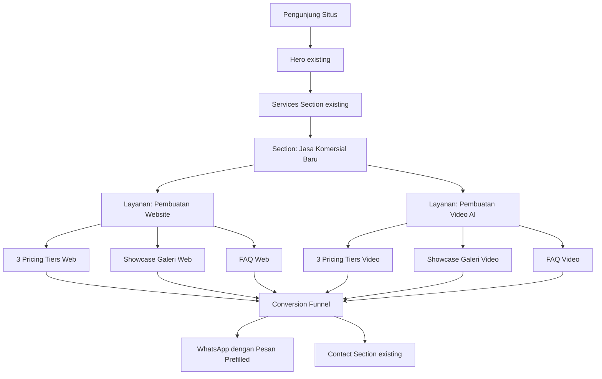
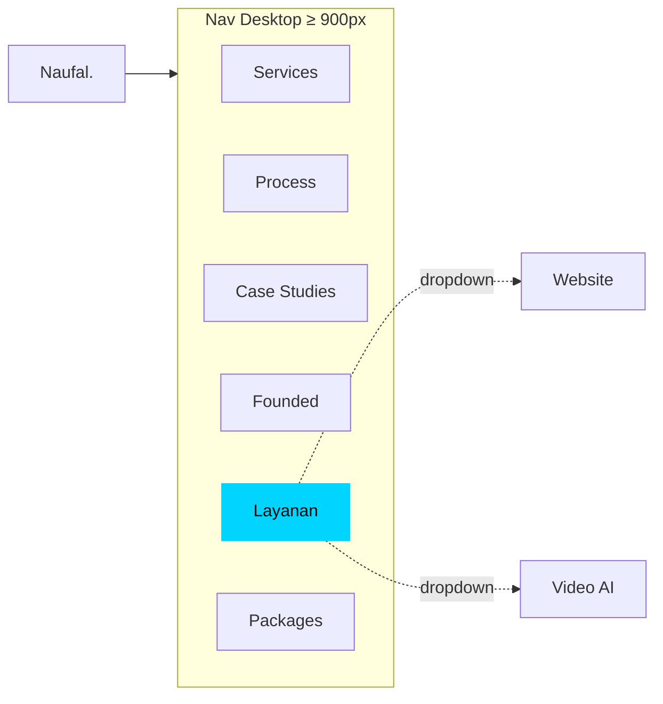
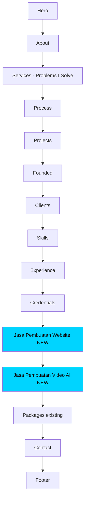
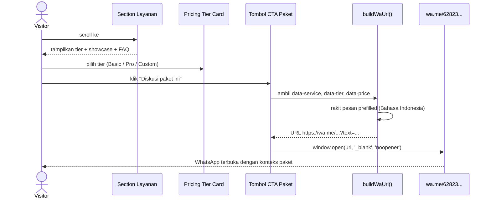

# Design Document: Jasa Pembuatan Website & Video AI

## Overview

Fitur ini memperluas situs portofolio `naufalnabila.my.id` menjadi etalase produktisasi dua layanan komersial baru: **Pembuatan Website** dan **Pembuatan Video AI**. Sasarannya adalah audiens UMKM, founder, dan organisasi berbahasa Indonesia yang membutuhkan dua hal konkret — situs profesional yang bisa dipercaya dan video pemasaran berbasis AI — tanpa harus menyewa agensi penuh.

Bagian baru ini dirancang sebagai *productized service* dengan tiga tier harga jelas (Basic / Pro / Custom) per layanan, *showcase gallery*, alur proses singkat, FAQ, dan CTA WhatsApp langsung. Implementasinya tetap pada tumpukan teknis existing — HTML statis + CSS modular + JavaScript vanilla — agar konsisten dengan arsitektur portfolio saat ini dan tidak menambah dependensi runtime.

Pendekatan desain mengikuti tone existing situs: *operator-grade*, *problem-led*, dan berorientasi *business outcome* — bukan agency-style yang generik. Konversi diukur dari satu metrik utama: *qualified WhatsApp lead* dengan konteks paket yang sudah pre-filled di pesan pertama.

## Architecture

### High-Level System Diagram



### Information Architecture — Perubahan Navigasi

Navigasi existing memiliki 5 item: `Services · Process · Case Studies · Founded · Packages`. Dua entry point baru ditambahkan **tanpa** memekarkan navbar di mobile (yang sudah hidden di breakpoint < 900px), dengan strategi:



Item nav baru `Layanan` adalah tautan dengan dropdown sederhana (CSS `:hover` + `:focus-within`) yang membuka dua sub-link: `Website` (anchor `#jasa-website`) dan `Video AI` (anchor `#jasa-video-ai`). Dropdown menggunakan transisi opacity + `pointer-events` untuk aksesibilitas keyboard.

### Section Layout — Posisi Section Baru



**Rasional posisi**: section baru diletakkan sebelum `Packages` (bukan setelah Hero) karena:
1. Visitor sudah melihat *proof* (Projects, Clients, Founded) sehingga komitmen harga lebih dipercaya.
2. Section `Packages` existing tetap berdiri untuk audiens *enterprise / AI / ERP* — segmen berbeda dari pembeli paket website/video AI yang lebih *self-serve*.
3. Menghindari konflik framing: hero existing fokus pada "AI systems for messy operations". Layanan baru adalah produk paralel, bukan menggantikan positioning utama.

### Conversion Funnel — Visitor → Qualified Lead



## Components and Interfaces

### Komponen Baru

| Komponen | Class CSS Utama | File CSS Tujuan | Tujuan |
|---|---|---|---|
| Service Hero Block | `.service-hero` | `services-commercial.css` | Pembuka tiap layanan (judul, sub, ringkasan benefit) |
| Pricing Tier Grid | `.tier-grid`, `.tier-card`, `.tier-card.featured` | `services-commercial.css` | Kartu 3 tier sebaris di desktop, stack di mobile |
| Showcase Gallery | `.showcase-grid`, `.showcase-card` | `services-commercial.css` | Galeri sample (gambar/preview thumbnail) |
| FAQ Accordion | `.faq-list`, `.faq-item`, `.faq-q`, `.faq-a` | `services-commercial.css` | Accordion menggunakan `<details>` native |
| Service Process Strip | `.svc-flow`, `.svc-step` | `services-commercial.css` | 4 step proses ringkas per layanan |
| Nav Dropdown | `.nav-dropdown`, `.nav-dropdown-menu` | `layout.css` (extend) | Dropdown "Layanan" di navbar desktop |

### Component Interface (sebagai data contract — bukan TypeScript interface karena codebase plain JS)

```javascript
/**
 * @typedef {Object} ServiceTier
 * @property {string} id            - slug unik, contoh: "web-basic"
 * @property {string} service       - "website" | "video-ai"
 * @property {string} name          - "Basic" | "Pro" | "Custom"
 * @property {string} priceLabel    - tampilan harga, contoh: "Rp 2.500.000"
 * @property {string} priceNote     - catatan, contoh: "/ project · sekali bayar"
 * @property {string} idealFor      - "Untuk UMKM yang baru go-online"
 * @property {string[]} deliverables - bullet point yang dapat ditampilkan
 * @property {number} timelineDays  - 7, 14, 21, ...
 * @property {boolean} featured     - apakah jadi tier highlight tengah
 * @property {string} ctaLabel      - "Diskusi paket ini" | "Custom request"
 */

/**
 * @typedef {Object} ShowcaseItem
 * @property {string} id          - slug unik
 * @property {string} service     - "website" | "video-ai"
 * @property {string} title       - "Landing page Klinik Bahari"
 * @property {string} category    - "Landing Page" | "Company Profile" | "Iklan Produk"
 * @property {string} thumbnail   - path relatif ke assets/images/showcase/...
 * @property {string} [link]      - opsional, link demo/preview
 * @property {string[]} tags      - chip kecil di kartu
 */

/**
 * @typedef {Object} FAQItem
 * @property {string} id        - slug unik untuk anchor
 * @property {string} service   - "website" | "video-ai" | "general"
 * @property {string} question  - copy pertanyaan
 * @property {string} answer    - copy jawaban (HTML-safe plain text)
 */
```

**Catatan penting**: Karena situs adalah static HTML, data ini ditulis langsung di markup HTML. Object di atas bersifat *konseptual* — sebagai kontrak antara content writer dan struktur DOM. Tidak ada JSON yang di-fetch saat runtime.

### Komponen Existing yang Dimodifikasi

| Komponen | Perubahan |
|---|---|
| `<nav>` di `index.html` | Tambah `<li class="nav-dropdown">` untuk "Layanan" dengan dropdown menu |
| `assets/js/nav.js` | Tambah handler dropdown untuk klik mobile + close on outside click |
| `<head>` di `index.html` | Update `<meta name="description">` + tambah `og:*` & `twitter:*` tags |

## Data Models

### Catatan Tier — Pembuatan Website

```javascript
const WEBSITE_TIERS = [
  {
    id: "web-basic",
    service: "website",
    name: "Basic",
    priceLabel: "Rp 2.500.000",
    priceNote: "sekali bayar · 1 minggu",
    idealFor: "UMKM atau personal brand yang baru go-online",
    deliverables: [
      "1 landing page (1 halaman, sampai 5 section)",
      "Domain & hosting setup (.com / .my.id)",
      "Mobile-responsive · SEO basic on-page",
      "Form WhatsApp / kontak terhubung langsung",
      "Revisi 2x dalam masa pengerjaan"
    ],
    timelineDays: 7,
    featured: false,
    ctaLabel: "Diskusi paket Basic"
  },
  {
    id: "web-pro",
    service: "website",
    name: "Pro",
    priceLabel: "Rp 6.500.000",
    priceNote: "sekali bayar · 2-3 minggu",
    idealFor: "Bisnis yang sudah jalan, butuh website company profile",
    deliverables: [
      "Sampai 8 halaman (Home, About, Services, Blog, Kontak, dst.)",
      "CMS sederhana untuk update konten sendiri",
      "Integrasi WhatsApp, Google Analytics, Meta Pixel",
      "SEO setup · sitemap · meta · schema.org",
      "Revisi 3x · dukungan 30 hari setelah live"
    ],
    timelineDays: 21,
    featured: true,
    ctaLabel: "Diskusi paket Pro"
  },
  {
    id: "web-custom",
    service: "website",
    name: "Custom",
    priceLabel: "Mulai Rp 15.000.000",
    priceNote: "kuotasi · 4+ minggu",
    idealFor: "Web app, dashboard, e-commerce, atau sistem internal",
    deliverables: [
      "Custom UI/UX sesuai kebutuhan",
      "Database & autentikasi (login, role, dashboard)",
      "Integrasi payment, marketplace, atau API pihak ketiga",
      "Deploy ke production · CI/CD · monitoring",
      "Dokumentasi & handover"
    ],
    timelineDays: 30,
    featured: false,
    ctaLabel: "Konsultasi custom"
  }
];
```

### Catatan Tier — Pembuatan Video AI

```javascript
const VIDEO_AI_TIERS = [
  {
    id: "vid-basic",
    service: "video-ai",
    name: "Basic",
    priceLabel: "Rp 750.000",
    priceNote: "per video · 3-5 hari",
    idealFor: "Konten reels / iklan singkat untuk sosial media",
    deliverables: [
      "1 video durasi 15-30 detik",
      "Voiceover AI (ID/EN) · subtitle auto",
      "Resolusi 1080p · format vertical 9:16 atau 16:9",
      "1 revisi minor (script atau musik)",
      "File final mp4 + raw asset"
    ],
    timelineDays: 5,
    featured: false,
    ctaLabel: "Diskusi paket Basic"
  },
  {
    id: "vid-pro",
    service: "video-ai",
    name: "Pro",
    priceLabel: "Rp 2.000.000",
    priceNote: "per video · 7-10 hari",
    idealFor: "Iklan produk, company profile pendek, edukasi",
    deliverables: [
      "1 video durasi 60-90 detik",
      "Naskah disusun bersama · storyboard sederhana",
      "Voiceover multi-bahasa (ID/EN/AR/MS) opsional",
      "B-roll AI · animasi teks · brand color",
      "2 revisi · format multi-platform (TikTok, IG, YouTube)"
    ],
    timelineDays: 10,
    featured: true,
    ctaLabel: "Diskusi paket Pro"
  },
  {
    id: "vid-custom",
    service: "video-ai",
    name: "Custom",
    priceLabel: "Mulai Rp 5.000.000",
    priceNote: "kuotasi · per project / per bulan",
    idealFor: "Kampanye, course series, atau retainer konten bulanan",
    deliverables: [
      "Multi-episode (course / series video)",
      "Pipeline AI custom · multi-language video pipeline",
      "Integrasi dengan brand asset existing",
      "Schedule publishing · iterasi performa konten",
      "Retainer bulanan tersedia"
    ],
    timelineDays: 30,
    featured: false,
    ctaLabel: "Konsultasi custom"
  }
];
```

### Validation Rules

| Field | Rule |
|---|---|
| `priceLabel` | Format: `Rp X.XXX.XXX` (titik ribuan) atau `Mulai Rp X.XXX.XXX` |
| `timelineDays` | Integer positif, ditampilkan sebagai "7 hari" / "2 minggu" |
| `deliverables` | Minimum 3 bullet, maksimum 6 bullet (ergonomi kartu) |
| `featured` | Tepat 1 tier per layanan boleh `featured: true` |
| Tier order | Selalu Basic → Pro → Custom (kiri → kanan, naik harga) |

### FAQ Content Model

```javascript
const FAQ_WEBSITE = [
  { id: "faq-w-1", question: "Berapa lama proses pengerjaan?", answer: "Basic 1 minggu, Pro 2-3 minggu, Custom mulai 4 minggu tergantung scope." },
  { id: "faq-w-2", question: "Apakah saya dapat source code?", answer: "Ya. Semua source code, akses domain, dan akses hosting menjadi milik Anda penuh." },
  { id: "faq-w-3", question: "Bagaimana sistem revisinya?", answer: "Revisi terbatas sesuai paket. Revisi major di luar scope dihitung terpisah dengan kuotasi transparan sebelum dieksekusi." },
  { id: "faq-w-4", question: "Apakah bisa update sendiri setelah jadi?", answer: "Paket Pro dan Custom dilengkapi CMS. Paket Basic landing page biasanya update via permintaan kecil." },
  { id: "faq-w-5", question: "Bagaimana cara pembayarannya?", answer: "DP 50% di awal, pelunasan saat website live. Untuk Custom bisa termin per milestone." }
];

const FAQ_VIDEO_AI = [
  { id: "faq-v-1", question: "Apakah video benar-benar dibuat AI?", answer: "Ya, kombinasi pipeline AI (script, voice, visual) yang dikurasi manual untuk hasil yang natural dan sesuai brand." },
  { id: "faq-v-2", question: "Apakah suara AI terdengar natural?", answer: "Saya pakai voice model premium ID/EN/AR/MS yang sudah saya gunakan untuk Pembelajar Belajar dan EdTech sendiri." },
  { id: "faq-v-3", question: "Bisa pakai wajah / suara saya sendiri?", answer: "Bisa di paket Pro dan Custom. Saya butuh sample voice/foto untuk training cepat." },
  { id: "faq-v-4", question: "Format dan rasio apa yang didukung?", answer: "9:16 (TikTok, Reels, Shorts), 1:1 (feed IG/FB), 16:9 (YouTube, ads)." },
  { id: "faq-v-5", question: "Apakah bisa retainer bulanan?", answer: "Bisa. Paket Custom bisa diatur jadi 4-8 video per bulan dengan harga retainer." }
];
```

## Algorithmic Pseudocode

### Algoritma 1: Build WhatsApp URL dengan Pesan Prefilled

```pascal
ALGORITHM buildWaUrl(phone, service, tier, price)
INPUT:
  phone: String  // contoh: "6282328591004"
  service: String  // "website" | "video-ai"
  tier: String  // "Basic" | "Pro" | "Custom"
  price: String  // "Rp 2.500.000" atau "Mulai Rp 15.000.000"
OUTPUT:
  url: String  // https://wa.me/...?text=...

PRECONDITION:
  - phone hanya berisi digit (regex /^\d{10,15}$/)
  - service ∈ {"website", "video-ai"}
  - tier ∈ {"Basic", "Pro", "Custom"}
  - price tidak null dan tidak empty

POSTCONDITION:
  - Hasil dimulai dengan "https://wa.me/" + phone
  - Mengandung query string "?text=" dengan pesan ter-encode
  - Pesan plaintext dapat diparse balik dengan decodeURIComponent
  - Tidak terjadi side effect (pure function)

BEGIN
  ASSERT isValidPhone(phone) = true

  // Step 1: Pilih label layanan dalam Bahasa Indonesia
  IF service = "website" THEN
    serviceLabel ← "Pembuatan Website"
  ELSE IF service = "video-ai" THEN
    serviceLabel ← "Pembuatan Video AI"
  ELSE
    serviceLabel ← "Layanan"
  END IF

  // Step 2: Rakit pesan terstruktur
  message ← "Halo Mas Naufal, saya tertarik dengan paket "
          + tier + " untuk layanan "
          + serviceLabel + " ("
          + price + "). Bisa minta info lebih lanjut?"

  // Step 3: Encode aman untuk URL
  encoded ← encodeURIComponent(message)

  // Step 4: Susun URL final
  url ← "https://wa.me/" + phone + "?text=" + encoded

  ASSERT url.startsWith("https://wa.me/" + phone)
  ASSERT decodeURIComponent(url.split("?text=")[1]) = message

  RETURN url
END
```

**Preconditions**:
- `phone` adalah string hanya berisi digit, panjang 10-15 karakter (format internasional Indonesia tanpa `+`).
- `service`, `tier`, `price` adalah non-empty string.

**Postconditions**:
- Return value berupa absolute HTTPS URL.
- Pesan yang ter-encode dapat di-decode kembali utuh.
- Fungsi murni — tidak melakukan DOM access, network, atau logging.

**Loop Invariants**: N/A (tidak ada loop).

### Algoritma 2: Attach CTA Handler ke Semua Tier Card

```pascal
ALGORITHM initServiceCtaHandlers(rootElement)
INPUT:
  rootElement: HTMLElement  // biasanya document
OUTPUT:
  void  // efek samping: event listener ter-attach

PRECONDITION:
  - rootElement adalah node DOM yang valid
  - Setiap .tier-card memiliki atribut data-service, data-tier, data-price

POSTCONDITION:
  - Setiap [data-cta="service"] memiliki click listener
  - Listener memanggil buildWaUrl dan window.open
  - Tidak ada listener yang ter-attach lebih dari sekali (idempotent)

BEGIN
  ctaButtons ← rootElement.querySelectorAll('[data-cta="service"]')

  FOR each btn IN ctaButtons DO
    ASSERT btn.dataset.service ∈ {"website", "video-ai"}
    ASSERT btn.dataset.tier ∈ {"Basic", "Pro", "Custom"}

    // Guard idempotency — skip jika sudah pernah di-attach
    IF btn.dataset.ctaAttached = "true" THEN
      CONTINUE
    END IF

    btn.addEventListener("click", FUNCTION(event)
      event.preventDefault()
      url ← buildWaUrl(
        WHATSAPP_PHONE,
        btn.dataset.service,
        btn.dataset.tier,
        btn.dataset.price
      )
      window.open(url, "_blank", "noopener,noreferrer")
    END FUNCTION)

    btn.dataset.ctaAttached ← "true"
  END FOR
END
```

**Preconditions**:
- `WHATSAPP_PHONE` konstanta global (`"6282328591004"`).
- Markup HTML mengandung atribut data-* lengkap pada setiap tombol CTA tier.

**Postconditions**:
- Semua tombol CTA tier menjadi *interactive* dan membuka WhatsApp.
- Re-call fungsi ini aman (tidak menggandakan listener).

**Loop Invariants**:
- Setelah iterasi ke-i: tombol 0..i-1 sudah punya `data-cta-attached="true"`.

### Algoritma 3: FAQ Accordion (Native `<details>` — Tanpa JavaScript)

Kami **tidak** membuat custom accordion. Sebagai gantinya, gunakan elemen HTML native `<details>` dan `<summary>` yang sudah:
- Aksesibel (keyboard `Enter`/`Space`).
- Bekerja tanpa JS.
- Bisa dikustom CSS-nya.

```pascal
PROCEDURE renderFaqAccordion(faqList, container)
INPUT:
  faqList: List<FAQItem>
  container: HTMLElement
OUTPUT: void

BEGIN
  FOR each item IN faqList DO
    detailsEl ← create <details class="faq-item" id={item.id}>
    summaryEl ← create <summary class="faq-q">{item.question}</summary>
    answerEl ← create <div class="faq-a">{item.answer}</div>

    detailsEl.append(summaryEl, answerEl)
    container.append(detailsEl)
  END FOR
END
```

**Catatan**: Karena situs adalah static HTML, "rendering" ini dilakukan sekali saat menulis `index.html`. Tidak ada DOM generation runtime.

### Algoritma 4: Smooth Scroll untuk Anchor Nav (Sudah Ada via CSS)

Anchor scroll sudah ditangani oleh `html { scroll-behavior: smooth; }` di `base.css`. Tidak perlu JS tambahan untuk menu dropdown nav baru.

## Key Functions with Formal Specifications

### `buildWaUrl(phone, service, tier, price)`

```javascript
/**
 * Bangun URL WhatsApp dengan pesan prefilled berbahasa Indonesia.
 * Fungsi murni, tidak ada side effect.
 *
 * @param {string} phone   - digit only, panjang 10-15
 * @param {string} service - "website" | "video-ai"
 * @param {string} tier    - "Basic" | "Pro" | "Custom"
 * @param {string} price   - label harga, contoh "Rp 2.500.000"
 * @returns {string} URL absolut https://wa.me/...?text=...
 */
function buildWaUrl(phone, service, tier, price)
```

**Preconditions**:
- `phone` matches `/^\d{10,15}$/`.
- `service` ∈ `{"website", "video-ai"}`.
- `tier` ∈ `{"Basic", "Pro", "Custom"}`.
- `price` non-empty string.

**Postconditions**:
- Return string starts with `"https://wa.me/" + phone + "?text="`.
- `decodeURIComponent(url.split("?text=")[1])` yields the original Indonesian message.
- Pesan mengandung substring `tier`, `serviceLabel`, dan `price`.
- Tidak ada side effect (tidak menulis DOM, tidak request network).

**Loop Invariants**: N/A.

### `initServiceCtaHandlers(root)`

```javascript
/**
 * Attach click listener ke setiap tombol [data-cta="service"].
 * Idempotent — aman dipanggil ulang.
 *
 * @param {Document|HTMLElement} root
 * @returns {void}
 */
function initServiceCtaHandlers(root)
```

**Preconditions**:
- `root` adalah DOM node valid dengan method `querySelectorAll`.
- Setiap `.tier-card .package-cta` punya `data-service`, `data-tier`, `data-price`.

**Postconditions**:
- Setiap `[data-cta="service"]` di-attach satu listener (tidak ganda).
- Klik tombol membuka tab baru WhatsApp.
- Re-invoke aman.

**Loop Invariant**: Setelah iterasi ke-i, tombol 0..i-1 sudah memiliki `data-cta-attached="true"`.

### `formatTimeline(days)` (utility kecil)

```javascript
/**
 * Konversi jumlah hari menjadi label Bahasa Indonesia yang manusiawi.
 *
 * @param {number} days
 * @returns {string}
 */
function formatTimeline(days)
```

**Preconditions**: `days` adalah integer positif (`days >= 1`).

**Postconditions**:
- Return string non-empty.
- `days < 7` → `"X hari"`.
- `7 <= days < 28` dan `days % 7 = 0` → `"X minggu"`.
- `days >= 28` → `"X bulan"` jika kelipatan 30, else `"~X minggu"`.

## Example Usage

### Markup HTML — Tier Card (contoh paket Web Pro)

```html
<article class="tier-card featured" data-tier-id="web-pro">
    <span class="tier-flag">Paling populer</span>
    <div class="tier-name">Pro</div>
    <div class="tier-price">
        <span class="tier-price-amount">Rp 6.500.000</span>
        <span class="tier-price-note">sekali bayar · 2-3 minggu</span>
    </div>
    <p class="tier-ideal">Untuk bisnis yang sudah jalan dan butuh website company profile.</p>
    <ul class="tier-deliverables">
        <li>Sampai 8 halaman (Home, About, Services, Blog, Kontak)</li>
        <li>CMS sederhana untuk update konten sendiri</li>
        <li>Integrasi WhatsApp, Google Analytics, Meta Pixel</li>
        <li>SEO setup · sitemap · meta · schema.org</li>
        <li>Revisi 3x · dukungan 30 hari setelah live</li>
    </ul>
    <a href="#contact"
       class="package-cta tier-cta"
       data-cta="service"
       data-service="website"
       data-tier="Pro"
       data-price="Rp 6.500.000">
        Diskusi paket Pro
    </a>
</article>
```

### Markup HTML — Section Layanan Website

```html
<section class="service-commercial" id="jasa-website">
    <div class="container">
        <span class="section-eyebrow fade-in">Layanan Komersial · Website</span>
        <h2 class="section-title fade-in">Pembuatan website yang siap kerja, bukan sekadar tampilan.</h2>
        <p class="section-subtitle fade-in">
            Saya bangun website yang langsung berfungsi sebagai mesin lead — terhubung WhatsApp,
            ter-tracking analytics, dan terstruktur agar tim Anda mudah update kontennya sendiri.
        </p>

        <div class="tier-grid fade-in">
            <!-- Basic / Pro / Custom -->
        </div>

        <div class="svc-flow fade-in"><!-- 4 step proses --></div>
        <div class="showcase-grid fade-in"><!-- galeri sample --></div>
        <div class="faq-list fade-in"><!-- 5 FAQ --></div>
    </div>
</section>
```

### JavaScript — Inisialisasi Module Baru `services.js`

```javascript
/* Service CTA — bangun pesan WhatsApp prefilled per tier paket */
(function () {
    const WHATSAPP_PHONE = "6282328591004";

    function buildWaUrl(phone, service, tier, price) {
        const labels = {
            "website": "Pembuatan Website",
            "video-ai": "Pembuatan Video AI"
        };
        const serviceLabel = labels[service] || "Layanan";
        const message =
            "Halo Mas Naufal, saya tertarik dengan paket " + tier +
            " untuk layanan " + serviceLabel +
            " (" + price + "). Bisa minta info lebih lanjut?";
        return "https://wa.me/" + phone + "?text=" + encodeURIComponent(message);
    }

    function initServiceCtaHandlers(root) {
        const buttons = root.querySelectorAll('[data-cta="service"]');
        buttons.forEach(function (btn) {
            if (btn.dataset.ctaAttached === "true") return;
            btn.addEventListener("click", function (event) {
                event.preventDefault();
                const url = buildWaUrl(
                    WHATSAPP_PHONE,
                    btn.dataset.service,
                    btn.dataset.tier,
                    btn.dataset.price
                );
                window.open(url, "_blank", "noopener,noreferrer");
            });
            btn.dataset.ctaAttached = "true";
        });
    }

    // Expose untuk testing
    window.__services = { buildWaUrl: buildWaUrl };

    initServiceCtaHandlers(document);
})();
```

### CSS — Tier Card (file baru `services-commercial.css`)

```css
/* ==========================================================================
   Service Commercial — pricing tiers, showcase, FAQ untuk Jasa Web & Video AI
   ========================================================================== */

.service-commercial {
    background: var(--bg);
}

.service-commercial + .service-commercial {
    background: var(--bg-alt);
}

.tier-grid {
    display: grid;
    grid-template-columns: repeat(3, 1fr);
    gap: 1.5rem;
    margin-bottom: 4rem;
}

.tier-card {
    background: var(--surface);
    border: 1px solid var(--border);
    border-radius: var(--radius-lg);
    padding: 2.25rem;
    display: flex;
    flex-direction: column;
    position: relative;
    transition: transform 0.3s ease, border-color 0.3s ease, box-shadow 0.3s ease;
}

.tier-card:hover {
    transform: translateY(-4px);
    border-color: color-mix(in srgb, var(--accent) 30%, var(--border));
    box-shadow: var(--shadow);
}

.tier-card.featured {
    border-color: color-mix(in srgb, var(--accent) 50%, var(--border));
    background:
        linear-gradient(180deg, color-mix(in srgb, var(--accent) 8%, transparent) 0%, transparent 50%),
        var(--surface);
    transform: translateY(-4px);
}

.tier-flag {
    position: absolute;
    top: 1.25rem;
    right: 1.25rem;
    background: var(--gradient);
    color: white;
    font-size: 0.72rem;
    font-weight: 700;
    text-transform: uppercase;
    letter-spacing: 0.12em;
    padding: 0.3rem 0.7rem;
    border-radius: 999px;
}

.tier-name {
    font-size: 1.4rem;
    font-weight: 700;
    color: var(--text);
    margin-bottom: 0.5rem;
}

.tier-price {
    display: flex;
    flex-direction: column;
    gap: 0.25rem;
    margin-bottom: 1.25rem;
    padding-bottom: 1.25rem;
    border-bottom: 1px dashed var(--border);
}

.tier-price-amount {
    font-size: 1.85rem;
    font-weight: 800;
    color: var(--accent);
    letter-spacing: -0.02em;
}

.tier-price-note {
    font-size: 0.92rem;
    color: var(--text-muted);
    font-weight: 500;
}

.tier-ideal {
    font-size: 1rem;
    color: var(--text-muted);
    line-height: 1.55;
    margin-bottom: 1.25rem;
}

.tier-deliverables {
    list-style: none;
    display: flex;
    flex-direction: column;
    gap: 0.55rem;
    flex: 1;
    margin-bottom: 1.5rem;
}

.tier-deliverables li {
    color: var(--text);
    font-size: 0.98rem;
    line-height: 1.5;
    padding-left: 1.6rem;
    position: relative;
}

.tier-deliverables li::before {
    content: '✓';
    position: absolute;
    left: 0;
    color: var(--accent);
    font-weight: 700;
}

.tier-cta {
    margin-top: auto;
}

/* Service Process Strip */
.svc-flow {
    display: grid;
    grid-template-columns: repeat(4, 1fr);
    gap: 1rem;
    margin-bottom: 4rem;
}

.svc-step {
    background: var(--surface);
    border: 1px solid var(--border);
    border-radius: var(--radius);
    padding: 1.5rem 1.4rem;
}

.svc-step-num {
    display: inline-block;
    background: var(--gradient);
    -webkit-background-clip: text;
    background-clip: text;
    color: transparent;
    font-size: 1.6rem;
    font-weight: 800;
    line-height: 1;
    margin-bottom: 0.5rem;
}

.svc-step-title {
    font-size: 1.05rem;
    font-weight: 700;
    color: var(--text);
    margin-bottom: 0.4rem;
}

.svc-step-desc {
    font-size: 0.92rem;
    color: var(--text-muted);
    line-height: 1.5;
}

/* Showcase Gallery */
.showcase-grid {
    display: grid;
    grid-template-columns: repeat(auto-fit, minmax(280px, 1fr));
    gap: 1.25rem;
    margin-bottom: 4rem;
}

.showcase-card {
    background: var(--surface);
    border: 1px solid var(--border);
    border-radius: var(--radius);
    overflow: hidden;
    transition: transform 0.3s ease, border-color 0.3s ease;
}

.showcase-card:hover {
    transform: translateY(-3px);
    border-color: color-mix(in srgb, var(--accent) 25%, var(--border));
}

.showcase-thumb {
    width: 100%;
    aspect-ratio: 16 / 10;
    object-fit: cover;
    background: var(--bg-soft);
    display: block;
}

.showcase-card[data-format="vertical"] .showcase-thumb {
    aspect-ratio: 9 / 16;
}

.showcase-body {
    padding: 1.1rem 1.25rem;
}

.showcase-cat {
    font-size: 0.78rem;
    font-weight: 700;
    text-transform: uppercase;
    letter-spacing: 0.12em;
    color: var(--accent);
    margin-bottom: 0.35rem;
}

.showcase-title {
    font-size: 1.05rem;
    font-weight: 700;
    color: var(--text);
    margin-bottom: 0.35rem;
}

.showcase-tags {
    display: flex;
    flex-wrap: wrap;
    gap: 0.35rem;
    margin-top: 0.6rem;
}

.showcase-tag {
    background: var(--accent-soft);
    color: var(--accent);
    padding: 0.25rem 0.6rem;
    border-radius: 6px;
    font-size: 0.78rem;
    font-weight: 600;
}

/* FAQ Accordion (native <details>) */
.faq-list {
    display: flex;
    flex-direction: column;
    gap: 0.75rem;
    max-width: 820px;
}

.faq-item {
    background: var(--surface);
    border: 1px solid var(--border);
    border-radius: var(--radius);
    padding: 1rem 1.4rem;
    transition: border-color 0.25s ease;
}

.faq-item[open] {
    border-color: color-mix(in srgb, var(--accent) 30%, var(--border));
}

.faq-q {
    font-size: 1.05rem;
    font-weight: 600;
    color: var(--text);
    cursor: pointer;
    list-style: none;
    display: flex;
    justify-content: space-between;
    align-items: center;
    gap: 1rem;
}

.faq-q::-webkit-details-marker { display: none; }

.faq-q::after {
    content: '+';
    font-size: 1.4rem;
    font-weight: 400;
    color: var(--accent);
    transition: transform 0.25s ease;
    line-height: 1;
}

.faq-item[open] .faq-q::after {
    content: '−';
    transform: rotate(0deg);
}

.faq-a {
    margin-top: 0.85rem;
    color: var(--text-muted);
    font-size: 1rem;
    line-height: 1.65;
}
```

### CSS — Responsive (extend `responsive.css`)

```css
/* Tier grid stack di mobile */
@media (max-width: 900px) {
    .tier-grid {
        grid-template-columns: 1fr;
    }

    .tier-card.featured {
        transform: none; /* hilangkan elevasi yang aneh saat stacked */
    }

    .svc-flow {
        grid-template-columns: repeat(2, 1fr);
    }
}

@media (max-width: 540px) {
    .svc-flow {
        grid-template-columns: 1fr;
    }

    .tier-price-amount {
        font-size: 1.6rem;
    }
}
```

## Correctness Properties

Sifat-sifat berikut bisa ditegaskan sebagai *property-based test* (mis. dengan fast-check) atau sebagai assertion biasa di test runner — tergantung kebutuhan.

> **Catatan**: referensi `Validates: Requirements X.Y` di bawah ini bersifat *forward-looking*. Karena workflow ini design-first, requirements final akan diderivasi dari design ini di langkah berikutnya. Penomoran dapat disesuaikan saat `requirements.md` ditulis.

### Property 1: URL absolut HTTPS yang valid

Untuk semua input valid, `buildWaUrl` selalu mengembalikan URL yang dimulai dengan `https://wa.me/{phone}?text=`.

**Validates: Requirements 1.1** (Conversion funnel mengarah ke WhatsApp lead)

```text
∀ phone ∈ digits(10..15), ∀ service ∈ {website, video-ai},
∀ tier ∈ {Basic, Pro, Custom}, ∀ price ∈ NonEmptyString:
  buildWaUrl(phone, service, tier, price).startsWith("https://wa.me/" + phone + "?text=")
```

### Property 2: Round-trip decode

Pesan yang ter-encode di query string dapat di-decode kembali ke string aslinya tanpa kehilangan informasi.

**Validates: Requirements 1.1** (Conversion funnel mengarah ke WhatsApp lead)

```text
∀ inputs valid:
  const url = buildWaUrl(phone, service, tier, price);
  const decoded = decodeURIComponent(url.split("?text=")[1]);
  decoded === expectedMessage(service, tier, price)
```

### Property 3: Pesan memuat tier, service label, dan price

Pesan WhatsApp yang dihasilkan harus selalu memuat ketiga komponen kontekstual sebagai substring agar context lead jelas.

**Validates: Requirements 1.2** (Pesan WhatsApp pre-filled dengan konteks paket)

```text
∀ inputs valid:
  const decoded = decodeURIComponent(url.split("?text=")[1]);
  decoded.includes(tier) ∧
  decoded.includes(serviceLabel(service)) ∧
  decoded.includes(price)
```

### Property 4: Tidak ada karakter unsafe yang lolos di query string

Semua karakter spesial URL harus ter-encode dengan benar.

**Validates: Requirements 1.1** (Conversion funnel mengarah ke WhatsApp lead)

```text
∀ inputs valid:
  const queryPart = url.split("?text=")[1];
  !/[ "&=?]/.test(queryPart)
```

### Property 5: initServiceCtaHandlers idempotent

Memanggil `initServiceCtaHandlers` lebih dari sekali tidak menggandakan event listener.

**Validates: Requirements 5.1** (Modul JS aman re-initialize)

```text
∀ root DOM:
  initServiceCtaHandlers(root);
  initServiceCtaHandlers(root);  // panggil 2x
  countAttached(root) === jumlah .tier-card  // tidak ganda
```

### Property 6: Markup contract — data attributes lengkap

Setiap CTA tier harus memiliki `data-service`, `data-tier`, dan `data-price` yang valid.

**Validates: Requirements 5.2** (Markup tier card mengikuti data-attribute contract)

```text
∀ card ∈ document.querySelectorAll('.tier-card .package-cta[data-cta="service"]'):
  card.dataset.service ∈ {"website", "video-ai"} ∧
  card.dataset.tier    ∈ {"Basic", "Pro", "Custom"} ∧
  card.dataset.price   !== "" ∧ card.dataset.price !== undefined
```

### Property 7: formatTimeline monoton

Untuk dua input `days` yang berbeda, output `formatTimeline` mempertahankan urutan kronologis.

**Validates: Requirements 2.3** (Timeline ditampilkan dalam Bahasa Indonesia yang konsisten)

```text
∀ d1, d2 ∈ ℕ⁺ dengan d1 < d2:
  parseTimelineDays(formatTimeline(d1)) <= parseTimelineDays(formatTimeline(d2))
```

### Property 8: FAQ collapsed by default

Saat halaman pertama kali render, semua item FAQ harus dalam keadaan tertutup.

**Validates: Requirements 4.1** (FAQ dapat dibuka/tutup, default tertutup)

```text
∀ item ∈ document.querySelectorAll('.faq-item'):
  initialRender(item).hasAttribute('open') === false
```

### Contoh Property-Based Test (fast-check)

```javascript
// services.test.js — opsional, hanya jika tim menambahkan test runner
import fc from 'fast-check';
import { buildWaUrl } from './services.js';

const validPhone = fc.stringMatching(/^\d{10,15}$/);
const validService = fc.constantFrom('website', 'video-ai');
const validTier = fc.constantFrom('Basic', 'Pro', 'Custom');
const validPrice = fc.string({ minLength: 1, maxLength: 30 });

test('PROP-1: URL selalu absolut HTTPS wa.me', () => {
  fc.assert(
    fc.property(validPhone, validService, validTier, validPrice,
      (phone, svc, tier, price) => {
        const url = buildWaUrl(phone, svc, tier, price);
        return url.startsWith(`https://wa.me/${phone}?text=`);
      })
  );
});

test('PROP-2: round-trip decode menghasilkan pesan asli', () => {
  fc.assert(
    fc.property(validPhone, validService, validTier, validPrice,
      (phone, svc, tier, price) => {
        const url = buildWaUrl(phone, svc, tier, price);
        const decoded = decodeURIComponent(url.split('?text=')[1]);
        return decoded.includes(tier) && decoded.includes(price);
      })
  );
});
```

## Error Handling

### Skenario 1: WhatsApp Tidak Bisa Dibuka

**Kondisi**: User di desktop tanpa WhatsApp Web; popup blocker memblokir `window.open`.

**Respons**: `wa.me` link tetap valid sebagai navigasi normal. Saat `window.open` dipanggil dengan target `_blank`, jika diblokir browser, fallback href `#contact` di anchor sudah default behaviour. Karena kita `event.preventDefault()` dahulu, kita perlu fallback eksplisit:

```javascript
const opened = window.open(url, "_blank", "noopener,noreferrer");
if (!opened) {
    // Fallback: navigate same-tab — user pasti sampai ke WA atau melihat error WA sendiri
    window.location.href = url;
}
```

**Recovery**: User bisa juga click section Contact existing untuk WhatsApp manual.

### Skenario 2: Data Attributes Hilang pada Tier Card

**Kondisi**: Editor lupa menulis `data-service` atau `data-tier`.

**Respons**: `buildWaUrl` mendapat `undefined`, menghasilkan pesan generik:

```
"Halo Mas Naufal, saya tertarik dengan paket undefined untuk layanan Layanan (undefined). ..."
```

**Recovery**:
- Defensive guard di handler — log warning ke console dan fallback ke pesan default tanpa tier:

```javascript
if (!btn.dataset.service || !btn.dataset.tier || !btn.dataset.price) {
    console.warn('[services] Missing data attributes on CTA', btn);
    window.open("https://wa.me/" + WHATSAPP_PHONE, "_blank", "noopener,noreferrer");
    return;
}
```

### Skenario 3: Image Showcase 404

**Kondisi**: Path `assets/images/showcase/...` salah ketik atau file belum di-commit.

**Respons**: `` agar layout tidak kolaps. Tambahkan placeholder gradient via background `var(--gradient-soft)` di `.showcase-thumb`.

**Recovery**: Showcase tetap menampilkan title + category + tags meski thumbnail gagal load.

### Skenario 4: User di Browser Lama Tanpa `<details>` Support

**Kondisi**: Browser sangat lama (IE, beberapa versi Android stock <5).

**Respons**: `<details>` di-fallback ke "selalu terbuka" — semua FAQ tampak. Acceptable degradation karena konten tetap dapat dibaca.

**Recovery**: Tidak diperlukan; tidak target browser tersebut.

## Testing Strategy

### Unit Testing Approach

Karena codebase saat ini **tidak punya test runner**, dua opsi:

**Opsi A (rekomendasi minimal)**: Tambahkan `tests/services.test.html` — halaman HTML manual yang load `services.js` lalu menampilkan hasil assertion sebagai daftar pass/fail. Cukup dijalankan saat developer mau memverifikasi tanpa setup tambahan.

**Opsi B (rekomendasi penuh)**: Tambahkan Vitest atau Jest minimal. Karena vanilla JS, cukup `npm i -D vitest` + satu file `services.test.js`. Tidak mengubah deployment (tests tidak di-include di build static).

### Property-Based Testing Approach

**Library**: `fast-check` (kompatibel Vitest/Jest, tidak butuh build tooling).

**Properties yang ditarget**:
- PROP-1 sampai PROP-4 (sifat `buildWaUrl`).
- PROP-7 (sifat `formatTimeline`).

**Yang tidak di-PBT**: PROP-5 (idempotency listener) dan PROP-6 (kontrak markup) — lebih cocok sebagai integration test atau lint rule HTML manual.

### Integration Testing Approach

Untuk static site, "integration test" cukup berupa **smoke checklist manual** sebelum deploy:

1. Buka `index.html` di browser, scroll ke `#jasa-website`.
2. Klik tombol CTA tier "Pro" — verifikasi URL WhatsApp berisi `Pro` dan `Rp 6.500.000`.
3. Ulangi untuk tier `Basic`, `Custom`, dan section `#jasa-video-ai`.
4. Toggle theme dark/light — pastikan kontras tier-card tetap baik.
5. Resize ke 540px — verifikasi tier-grid stack 1 kolom.
6. Buka semua FAQ — verifikasi accordion bekerja tanpa JS error.
7. Cek lighthouse: target ≥ 90 untuk Performance, ≥ 95 Accessibility, ≥ 95 SEO.

## Performance Considerations

- **Tidak ada framework baru**: tetap vanilla. Tidak menambah bundle size.
- **CSS modular**: tambahkan satu file baru `services-commercial.css?v=7` (bump versioning seluruh CSS untuk cache busting). Ukuran target file ini < 6KB minified.
- **JavaScript baru**: `services.js` < 1.5KB minified. Self-IIFE, no global pollution selain `window.__services` (untuk testing).
- **Showcase images**: gunakan `loading="lazy"` + format WebP/AVIF dengan fallback PNG. Maksimum 1200×750 untuk format 16:10, 720×1280 untuk format 9:16.
- **Web Vitals**: Pastikan `aspect-ratio` di CSS supaya tidak ada CLS saat thumbnail belum load.
- **Critical CSS**: Tidak diperlukan inline — situs sudah cepat. Cukup load `services-commercial.css` setelah `responsive.css`.

## Security Considerations

- **External link safety**: `target="_blank"` + `rel="noopener noreferrer"` di setiap link WhatsApp dan showcase eksternal.
- **XSS**: Karena situs static dan tidak ada user input yang di-render, risiko minimal. Pesan WhatsApp di-encode pakai `encodeURIComponent` — bukan dirender ke DOM.
- **Phone number exposure**: nomor WhatsApp `+62 823-2859-1004` sudah publik di section Contact existing. Tidak ada rahasia baru.
- **Form spam**: tidak ada form di section ini. Semua kontak via WhatsApp deep link.
- **CORS / CSP**: tidak ada perubahan; situs tetap tidak fetch resource eksternal kecuali Google Fonts (jika dipakai).

## SEO & Meta Updates

### `<head>` Update

```html
<title>Naufal Nabila — Jasa Pembuatan Website & Video AI · Indonesia</title>

<meta name="description"
    content="Jasa pembuatan website profesional dan video AI untuk bisnis di Indonesia. Paket Basic/Pro/Custom dengan harga transparan, timeline jelas, dan dukungan WhatsApp langsung.">

<meta name="keywords"
    content="jasa pembuatan website, jasa video AI, jasa landing page, jasa company profile, video AI Indonesia, naufal nabila">

<!-- Open Graph -->
<meta property="og:type" content="website">
<meta property="og:url" content="https://naufalnabila.my.id/">
<meta property="og:title" content="Jasa Pembuatan Website & Video AI · Naufal Nabila">
<meta property="og:description" content="Paket website dan video AI untuk UMKM, bisnis, dan founder di Indonesia. Hasil profesional, harga transparan.">
<meta property="og:image" content="https://naufalnabila.my.id/assets/images/og-cover.png">
<meta property="og:locale" content="id_ID">
<meta property="og:locale:alternate" content="en_US">

<!-- Twitter Card -->
<meta name="twitter:card" content="summary_large_image">
<meta name="twitter:title" content="Jasa Pembuatan Website & Video AI · Naufal Nabila">
<meta name="twitter:description" content="Paket website dan video AI untuk bisnis di Indonesia. Transparan, cepat, langsung WhatsApp.">
<meta name="twitter:image" content="https://naufalnabila.my.id/assets/images/og-cover.png">
```

### Schema.org JSON-LD (Service Offerings)

Tambahkan dua block `<script type="application/ld+json">` di akhir `<body>`:

```html
<script type="application/ld+json">
{
  "@context": "https://schema.org",
  "@type": "Service",
  "serviceType": "Pembuatan Website",
  "provider": {
    "@type": "Person",
    "name": "Naufal Nabila",
    "url": "https://naufalnabila.my.id/"
  },
  "areaServed": "Indonesia",
  "hasOfferCatalog": {
    "@type": "OfferCatalog",
    "name": "Paket Pembuatan Website",
    "itemListElement": [
      { "@type": "Offer", "name": "Basic",  "price": "2500000",  "priceCurrency": "IDR" },
      { "@type": "Offer", "name": "Pro",    "price": "6500000",  "priceCurrency": "IDR" },
      { "@type": "Offer", "name": "Custom", "price": "15000000", "priceCurrency": "IDR" }
    ]
  }
}
</script>
```

(Block serupa untuk "Pembuatan Video AI".)

### Sitemap & `lang` Attribute

- Update `<html lang="en">` → `<html lang="id">` karena audiens utama berbahasa Indonesia. Konten existing yang masih berbahasa Inggris boleh dibungkus `<span lang="en">` di tempat-tempat krusial (misal nama klien, jargon teknis).
- Pertahankan section Contact existing dwibahasa.

## Localization Stance

- **Section baru**: 100% Bahasa Indonesia (judul, sub, tier, deliverables, FAQ, CTA).
- **Section existing**: tetap Bahasa Inggris (untuk tidak merombak positioning yang sudah ada).
- **Mixed gracefully**: situs hibrid en/id dapat diterima — audiens utama Indonesia mengerti istilah teknis dasar (CMS, SEO, AI, dll). Tidak ada strategi i18n runtime, hanya copy statis dwibahasa.

## Mobile-First Responsive Considerations

| Breakpoint | Behaviour |
|---|---|
| `≥ 900px` | tier-grid 3 kolom, svc-flow 4 kolom, showcase auto-fit min 280px, navbar dengan dropdown "Layanan" |
| `< 900px` | tier-grid 1 kolom (stacked), svc-flow 2 kolom, dropdown nav disembunyikan (mengikuti pola navbar existing) |
| `< 540px` | svc-flow 1 kolom, tier-price font diperkecil dari 1.85rem → 1.6rem, padding tier-card dipertahankan |

**Catatan**: existing responsive.css sudah memutuskan untuk **tidak menampilkan hamburger nav di mobile**. Saya **tidak** mengubah keputusan itu di iterasi ini — section baru tetap dapat diakses via scroll. Kalau ke depan butuh hamburger, itu task terpisah.

**Touch targets**: semua tombol CTA mengikuti `.package-cta` existing — minimum tinggi ~44px (sesuai a11y guideline iOS/Android).

**Sticky element**: tidak ada. Section baru murni scroll konten — hindari kompleksitas sticky tier-card di mobile.

## Implementation Patterns Consistent With Existing Codebase

Pola yang **dipertahankan** dari codebase existing:

1. **CSS modular per concern**: tambah file baru `services-commercial.css`, jangan tumpuk di `style.css`.
2. **Versioning query param**: bump `?v=6` → `?v=7` di seluruh `<link rel="stylesheet">`.
3. **Vanilla JS dalam IIFE**: pola `(function () { ... })();` sama seperti `nav.js`, `theme.js`, `toggles.js`.
4. **Self-init module**: tidak ada bootstrap di `main.js`; module attach event listener saat di-load.
5. **Custom property tokens**: gunakan `var(--accent)`, `var(--surface)`, `var(--radius-lg)`, dll. Jangan hardcode warna.
6. **Section structure**: `<section class="..." id="..."><div class="container">...</div></section>` dengan `section-eyebrow` + `section-title` + `section-subtitle`.
7. **Fade-in pattern**: tambahkan class `fade-in` ke wrapper utama supaya `reveal.js` existing meng-handle animasi otomatis.
8. **Theme dual support**: tier-card harus terbaca baik di dark dan light mode — gunakan `--surface`, `--text`, `--border` (semuanya sudah ter-define di kedua mode di `base.css`).
9. **Light mode adjustments**: tidak perlu CSS khusus jika hanya pakai variable — `base.css` sudah handle override.

Pola yang **diperkenalkan baru**:

1. **Data-attribute driven CTA**: `data-cta="service"`, `data-service`, `data-tier`, `data-price` — pattern baru tapi sederhana, tidak pakai library.
2. **Native `<details>` accordion**: mengganti pola toggle existing yang manual (`toggleClients`, `toggleCerts`). Lebih ringan, lebih a11y-friendly.

## Dependencies

**Tidak ada dependensi runtime baru.**

Yang **opsional** (untuk tooling test, di luar production bundle):

- `fast-check` — property-based testing (devDependency).
- `vitest` — test runner (devDependency).

Existing dependencies yang tetap dipakai:
- Browser-native CSS custom properties (sudah dipakai).
- Browser-native `<details>`/`<summary>` (Baseline-supported sejak 2020).
- Browser-native `IntersectionObserver` (sudah dipakai di `reveal.js`).
- WhatsApp `wa.me` deep link (sudah dipakai di section Contact).

## File Changes Summary

| Path | Change |
|---|---|
| `index.html` | (1) Update `<html lang>` ke `id`, (2) update title + meta description + OG/Twitter, (3) tambah JSON-LD service schema, (4) tambah dropdown nav "Layanan", (5) tambah `<section class="service-commercial" id="jasa-website">` dan `id="jasa-video-ai">` sebelum `#packages`, (6) bump `?v=6` → `?v=7` |
| `assets/css/services-commercial.css` | **NEW** — semua styling tier card, svc-flow, showcase, faq |
| `assets/css/responsive.css` | Tambah breakpoint untuk tier-grid stack + svc-flow stack |
| `assets/css/layout.css` | Tambah `.nav-dropdown`, `.nav-dropdown-menu` styles |
| `assets/js/services.js` | **NEW** — `buildWaUrl`, `initServiceCtaHandlers` |
| `assets/images/showcase/` | **NEW directory** — sample thumbnail untuk web & video AI |
| `assets/images/og-cover.png` | **NEW** — 1200×630 untuk Open Graph (opsional tapi direkomendasikan) |

Total tambahan kode: ~250 baris CSS, ~40 baris JS, ~250 baris HTML markup. Tidak menyentuh struktur existing kecuali navbar dan section ordering.
