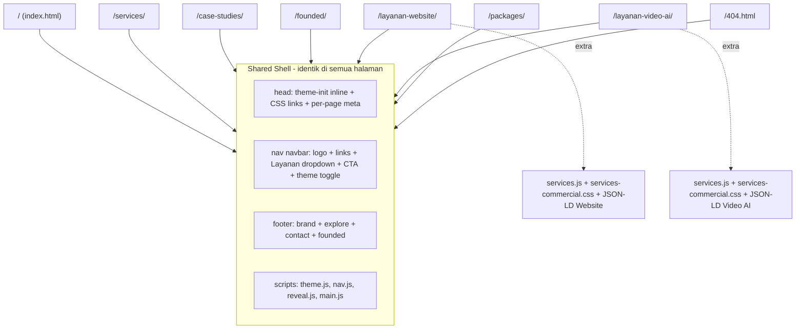
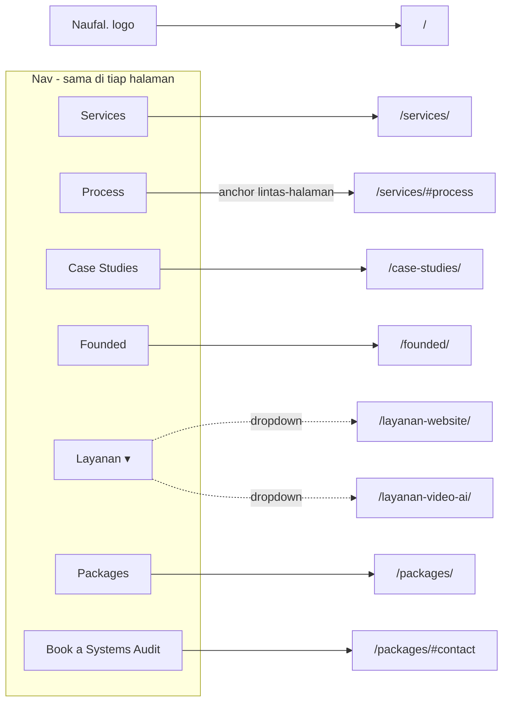
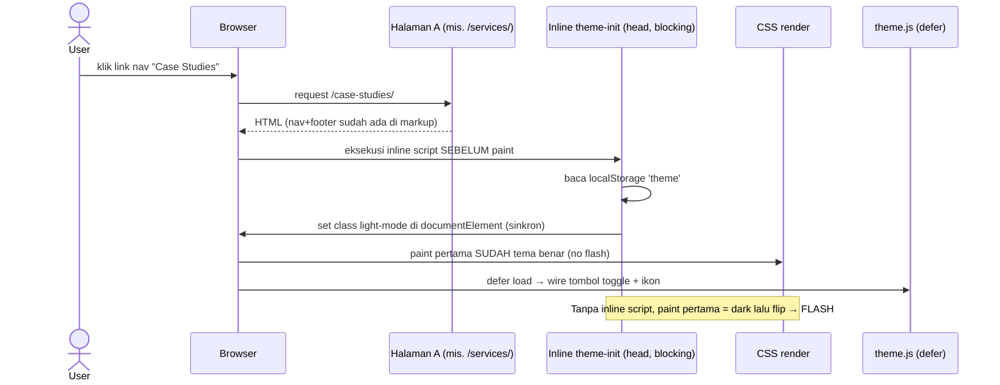

# Design Document: Multi-Page Restructure

## Overview

Fitur ini merestrukturisasi situs portofolio `naufalnabila.my.id` dari **satu halaman panjang** (`index.html` ~1600 baris dengan 15 section anchor) menjadi **situs multi-halaman (7 halaman)** yang dipetakan dari item menu navigasi. Tujuannya adalah memperbaiki *crawlability* dan *ranking* (situs ini adalah aset *lead-gen* komersial), mempercepat *time-to-content* per halaman, dan membuat setiap topik punya URL, `<title>`, dan meta sendiri yang bisa di-share dan di-index secara independen.

Tantangan utamanya bukan memecah konten — itu mekanis. Tantangan utamanya adalah **berbagi header (nav) dan footer ke 7 file HTML statis tanpa build tooling, tanpa merusak SEO, dan tanpa menimbulkan beban maintenance**. Situs ini 100% statis (plain HTML + CSS modular + JavaScript vanilla, tanpa bundler/framework/server-side include) dan harus tetap demikian agar deploy ke static hosting tetap sederhana. Dokumen ini mengevaluasi tiga strategi berbagi (duplikasi, injeksi JS, build step), menimbang dampaknya pada SEO, dan memberikan rekomendasi tegas.

Pendekatan desain mempertahankan arsitektur existing: CSS modular versioned (`?v=`), JavaScript modular yang *self-initializing* per file, dan tema dark/light berbasis `localStorage`. Perubahan perilaku terbesar adalah navigasi: dari *same-page anchor scroll* (`#services`) menjadi *cross-page link* (`/services/`), plus penanganan *theme flash* (FOUC) yang sekarang muncul di setiap perpindahan halaman. Tone tetap mengikuti situs existing: *operator-grade*, *business-outcome led*, konsisten dengan `jasa-website-video-ai/design.md`.

## Goals & Non-Goals

**Goals**
- Memecah `index.html` menjadi 7 halaman sesuai item navigasi, tanpa kehilangan konten.
- Mempertahankan situs 100% statis dan deployable ke static hosting tanpa langkah runtime tambahan.
- SEO per halaman: `<title>`, meta description, canonical, dan Open Graph/Twitter unik per halaman.
- Memindahkan dua schema JSON-LD `Service` ke halaman layanan masing-masing.
- Menghilangkan *theme flash* (FOUC) pada setiap navigasi antar halaman.
- Active-state highlighting di nav sesuai halaman aktif.
- Strategi berbagi header/footer yang minim maintenance namun aman SEO.
- **Mobile navigation**: hamburger menu untuk `<900px` agar mobile tetap punya navigasi antar halaman (sebelumnya nav disembunyikan).

**Non-Goals**
- Memperkenalkan framework, bundler, atau SPA router.
- Mengubah desain visual / copy section (selain pemecahan).
- Menambahkan CMS atau backend.

## Architecture

### Pemetaan 7 Halaman

Pemetaan final dari section existing ke 7 halaman. Kolom "Nav" menunjukkan item menu yang menuju halaman tersebut.

| # | Halaman | URL | Section existing yang dipindah | Nav item |
|---|---|---|---|---|
| 1 | **Home** | `/` (`index.html`) | Hero (`#home`) + About (`#about`) + ringkasan highlight + CTA | Logo → Home |
| 2 | **Services** | `/services/` | Services/"Problems I Solve" (`#services`) + Process (`#process`) | Services, Process |
| 3 | **Case Studies** | `/case-studies/` | Projects (`#projects`) + Clients (`#clients`) | Case Studies |
| 4 | **Founded** | `/founded/` | Founded (`#founded`) + Skills (`#skills`) + Experience (`#experience`) + Credentials (`#credentials`) | Founded |
| 5 | **Layanan Website** | `/layanan-website/` | Jasa Website (`#jasa-website`) + JSON-LD Website | Layanan → Website |
| 6 | **Layanan Video AI** | `/layanan-video-ai/` | Jasa Video AI (`#jasa-video-ai`) + JSON-LD Video AI | Layanan → Video AI |
| 7 | **Packages** | `/packages/` | Packages (`#packages`) + Contact (`#contact`) | Packages, CTA "Book a Systems Audit" |

**Rasional penempatan konten yang ambigu:**
- **About** → Home. About adalah perkenalan identitas/kredibilitas; paling natural sebagai bagian kedua halaman utama setelah Hero.
- **Skills / Experience / Credentials** → Founded. Ketiganya adalah klaster "bukti kapabilitas & track record operator". Disatukan dengan Founded platforms agar Home tetap ringkas dan halaman Founded menjadi halaman "siapa saya secara mendalam".
- **Clients** → Case Studies. Clients adalah bukti sosial yang memperkuat Projects; satu halaman "bukti kerja".
- **Contact** → **tidak** jadi halaman terpisah (agar tetap 7 halaman). Contact menjadi section di bawah halaman **Packages**, karena CTA utama "Book a Systems Audit" memang menuju kontak, dan Packages adalah titik konversi alami. Selain itu, **footer di setiap halaman** tetap memuat link WhatsApp/email sebagai jalur kontak global.

### High-Level: Struktur Situs & Shared Shell



### High-Level: Peta Navigasi (Internal Linking)



Catatan: item nav **Process** menunjuk ke `/services/#process` (anchor lintas-halaman), karena Process digabung ke halaman Services. Anchor lintas-halaman tetap didukung native browser dan `scroll-behavior: smooth` di `base.css`.

### Keputusan Inti — Strategi Berbagi Header/Footer

Ini adalah keputusan arsitektur paling penting. Tiga opsi dievaluasi terhadap prioritas utama situs: **SEO/crawlability** (situs lead-gen yang harus ranking), **kepatuhan pure-static**, dan **beban maintenance**.

| Kriteria | (A) Duplikasi markup | (B) Injeksi JS runtime | (C) Build/include step |
|---|---|---|---|
| SEO — nav/footer link ada di raw HTML | ✅ Ya, penuh | ⚠️ Tidak (di-render JS; bergantung *render budget* crawler) | ✅ Ya, output statis penuh |
| Distribusi *link equity* internal | ✅ Optimal | ⚠️ Berisiko tertunda/terlewat | ✅ Optimal |
| FOUC / layout shift (CLS) | ✅ Nihil | ❌ Nav muncul belakangan → CLS | ✅ Nihil |
| Berfungsi tanpa JS | ✅ Ya | ❌ Tidak | ✅ Ya |
| Pure-static, deploy apa adanya | ✅ Ya | ✅ Ya | ✅ Output statis (build lokal) |
| Beban maintenance (ubah nav) | ❌ Edit 7+ file | ✅ Satu sumber | ✅ Satu sumber (partial) |
| Tooling baru diperlukan | ✅ Tidak | ✅ Tidak | ⚠️ Ya (script Node minimal) |
| Risiko `fetch()` gagal di `file://` | — | ❌ Ya | — |

**Rekomendasi: Opsi A (Duplikasi) sebagai pendekatan utama v1, dengan partial sebagai *source of truth* + script build opsional (Opsi C) untuk menghapus beban maintenance.**

Alasan, langsung menjawab bobot SEO yang diminta:
1. **SEO adalah prioritas #1** untuk situs lead-gen. Nav + footer memuat link internal kritis yang mendistribusikan *link equity* ke 7 halaman. Link tersebut **harus** hadir di raw HTML, bukan hasil render JS. Ini langsung mendiskualifikasi Opsi B (injeksi JS) — meskipun Googlebot me-render JS, hal itu menambah latensi crawl, bergantung pada *render budget*, berisiko untuk crawler lain (Bing, social scrapers untuk OG), dan menambah CLS.
2. **Pure-static & lowest-friction.** Duplikasi tidak menambah tooling sama sekali, deploy persis seperti sekarang.
3. **Permukaan duplikasi kecil & stabil.** Hanya 7 halaman, dan nav/footer jarang berubah.
4. **Mitigasi maintenance:** simpan markup kanonik di `partials/_header.html` dan `partials/_footer.html` (sebagai sumber referensi, **tidak** di-fetch runtime), dan sediakan script Node **opsional tanpa dependensi npm** (`tools/build-pages.mjs`, hanya pakai `node:fs`) yang merakit ulang setiap halaman dari template + partials. Menjalankan script bersifat *opt-in*; artefak yang di-deploy tetap HTML statis murni. Tim yang tidak ingin build cukup mengedit langsung (duplikasi), tim yang ingin DRY menjalankan script.

Dengan kata lain: **default-nya duplikasi (aman, nol tooling), build script adalah jalur naik kelas opsional** yang mempertahankan output statis + SEO penuh sambil memberi satu sumber kebenaran.

### Penamaan File & Clean URL

**Rekomendasi: folder-based clean URLs** (`/services/index.html` → URL `/services/`) **+ asset path root-relative** (`/assets/...`).

```
portofolio/
├── index.html                      → /
├── 404.html                        → /404.html
├── services/index.html             → /services/
├── case-studies/index.html         → /case-studies/
├── founded/index.html              → /founded/
├── layanan-website/index.html      → /layanan-website/
├── layanan-video-ai/index.html     → /layanan-video-ai/
├── packages/index.html             → /packages/
├── partials/                       (source of truth, tidak dideploy-runtime)
│   ├── _header.html
│   └── _footer.html
├── tools/build-pages.mjs           (opsional, build lokal)
└── assets/ ...                     (tidak berubah lokasinya)
```

**Alasan folder-based:** menghasilkan URL bersih (`/services/`) yang portabel di **semua** static host tanpa konfigurasi per-host (berbeda dengan `services.html` yang butuh aturan "pretty URL" host-specific). Trade-off: file ada di subfolder, sehingga path relatif dokumen (`assets/...`) tidak lagi valid.

**Solusi path aset — root-relative (`/assets/...`):** semua referensi CSS/JS/gambar memakai leading slash sehingga resolve identik dari kedalaman folder mana pun. Ini **mengharuskan** deploy di root domain — yang memang kasusnya (`naufalnabila.my.id` disajikan di root). Ini perubahan wajib dari `assets/css/base.css?v=7` menjadi `/assets/css/base.css?v=8`.

> Alternatif lebih sederhana bila clean URL tidak wajib: file root-level (`services.html`, dst.) dengan path aset relatif apa adanya. Direkomendasikan **tidak** dipakai karena URL `.html` kurang ideal untuk SEO/berbagi dan butuh aturan host untuk dirapikan.

### Sequence: Navigasi Antar Halaman + Pencegahan Theme Flash



### Sequence: Active Nav Highlighting

```mermaid
sequenceDiagram
    participant DOM as DOMContentLoaded
    participant NavJS as nav.js setActiveNav()
    participant Path as location.pathname
    participant Links as nav a[href]

    DOM->>NavJS: trigger
    NavJS->>Path: ambil pathname (mis. "/case-studies/")
    NavJS->>Links: iterasi setiap link nav
    loop tiap link
        NavJS->>NavJS: normalisasi href vs pathname
        alt cocok
            NavJS->>Links: tambah .active + aria-current="page"
        else tidak
            NavJS->>Links: pastikan tidak ada .active
        end
    end
```

## Components and Interfaces

### Komponen Shared (identik di tiap halaman)

| Komponen | Lokasi | Tujuan | Perubahan dari existing |
|---|---|---|---|
| Theme-init inline script | `<head>` tiap halaman | Set tema sebelum paint (anti-FOUC) | **Baru** |
| Nav `#navbar` | `partials/_header.html` → tiap halaman | Navigasi cross-page + dropdown Layanan + CTA + theme toggle | Href anchor → URL; tambah dukungan active state |
| Footer | `partials/_footer.html` → tiap halaman | Brand, Explore links, Contact, Founded | Href anchor → URL |
| Mobile hamburger | `partials/_header.html` + `nav.js` | Buka/tutup `.nav-links` di `<900px` | **Baru** |
| `theme.js` | `/assets/js/` | Wire tombol toggle + persist | Refactor: target `documentElement`, hentikan FOUC |
| `nav.js` | `/assets/js/` | `.scrolled` state + `setActiveNav()` + toggle hamburger | Tambah `setActiveNav()` + `initMobileNav()` |
| `reveal.js` | `/assets/js/` | Fade-in IntersectionObserver | Tidak berubah (jalan per halaman) |
| `toggles.js` | `/assets/js/` | `toggleClients`/`toggleCerts` | Hanya di-load di Case Studies & Founded |
| `services.js` | `/assets/js/` | CTA WhatsApp deep link | Hanya di-load di 2 halaman Layanan |

### Interface — Konfigurasi Halaman (data contract)

Karena situs statis, "konfigurasi" ini adalah kontrak konseptual antara template dan tiap halaman. Bila build script dipakai, object ini menjadi input nyata; bila duplikasi manual, ini adalah checklist meta yang harus diisi per halaman.

```javascript
/**
 * @typedef {Object} PageMeta
 * @property {string} slug         - "", "services", "case-studies", ... (untuk active nav)
 * @property {string} path         - URL kanonik, mis. "/services/"
 * @property {string} title        - <title> unik
 * @property {string} description  - meta description unik (<=160 char)
 * @property {string} canonical    - URL absolut, mis. "https://naufalnabila.my.id/services/"
 * @property {string} ogTitle
 * @property {string} ogDescription
 * @property {string} ogImage      - URL absolut OG image
 * @property {string[]} extraCss   - CSS tambahan selain core (mis. ["services-commercial"])
 * @property {string[]} extraJs    - JS tambahan selain core (mis. ["toggles","services"])
 * @property {Object|null} jsonLd  - schema.org JSON-LD khusus halaman (atau null)
 */

/**
 * @typedef {Object} NavItem
 * @property {string} label        - "Services", "Case Studies", ...
 * @property {string} href         - "/services/", "/services/#process", ...
 * @property {string} matchSlug    - slug halaman yang membuat item ini "active"
 * @property {NavItem[]} [children] - sub-link untuk dropdown "Layanan"
 */
```

### Daftar Aset Wajib per Halaman

CSS core (semua halaman): `base, layout, hero?, sections, components, responsive`. Hero CSS hanya wajib di Home. JS core (semua halaman): `theme, nav, reveal, main`.

| Halaman | extraCss | extraJs | jsonLd |
|---|---|---|---|
| Home | — | — | `Person`/`WebSite` (opsional) |
| Services | — | — | — |
| Case Studies | — | `toggles` (untuk `toggleClients`) | — |
| Founded | — | `toggles` (untuk `toggleCerts`) | — |
| Layanan Website | `services-commercial` | `services` | `Service` (Website) |
| Layanan Video AI | `services-commercial` | `services` | `Service` (Video AI) |
| Packages | — | — | — |

## Data Models

### Definisi Navigasi (kanonik)

```javascript
const NAV_ITEMS = [
  { label: "Services",     href: "/services/",            matchSlug: "services" },
  { label: "Process",      href: "/services/#process",    matchSlug: "services" },
  { label: "Case Studies", href: "/case-studies/",        matchSlug: "case-studies" },
  { label: "Founded",      href: "/founded/",             matchSlug: "founded" },
  {
    label: "Layanan", href: "/layanan-website/", matchSlug: "layanan",
    children: [
      { label: "Website",  href: "/layanan-website/",   matchSlug: "layanan-website" },
      { label: "Video AI", href: "/layanan-video-ai/",  matchSlug: "layanan-video-ai" }
    ]
  },
  { label: "Packages",     href: "/packages/",            matchSlug: "packages" }
];

const NAV_CTA = { label: "Book a Systems Audit", href: "/packages/#contact" };
const LOGO    = { label: "Naufal.", href: "/" };
```

### Daftar Halaman (untuk validasi link & build)

```javascript
const PAGES = [
  { slug: "",                 path: "/",                   file: "index.html" },
  { slug: "services",         path: "/services/",          file: "services/index.html" },
  { slug: "case-studies",     path: "/case-studies/",      file: "case-studies/index.html" },
  { slug: "founded",          path: "/founded/",           file: "founded/index.html" },
  { slug: "layanan-website",  path: "/layanan-website/",   file: "layanan-website/index.html" },
  { slug: "layanan-video-ai", path: "/layanan-video-ai/",  file: "layanan-video-ai/index.html" },
  { slug: "packages",         path: "/packages/",          file: "packages/index.html" },
  { slug: "404",              path: "/404.html",           file: "404.html" }
];
```

### Validation Rules

| Aturan | Detail |
|---|---|
| Satu `<nav id="navbar">` per halaman | Tepat 1, tidak lebih |
| Satu `<footer>` per halaman | Tepat 1 |
| Satu `<h1>` per halaman | Tepat 1, untuk SEO |
| `<title>` unik | Tidak boleh duplikat antar halaman |
| `meta[name=description]` | Ada, panjang 50–160 karakter |
| `link[rel=canonical]` | Ada, absolut, cocok dengan `path` halaman |
| OG tags | `og:title`, `og:description`, `og:url`, `og:image`, `og:type` ada |
| Asset path | Selalu root-relative (`/assets/...`) |
| JSON-LD `Service` | Hanya di halaman layanan terkait, tepat 1 per halaman |
| Internal link | Setiap href internal resolve ke file yang ada di `PAGES` |
| Active nav | Tepat 1 item nav (atau induk dropdown) ber-`aria-current="page"` |

## Algorithmic Pseudocode

### Algoritma 1: Anti-FOUC Theme Init (inline, blocking, di `<head>`)

Inti pencegahan *theme flash*. Harus berupa script **inline & sinkron** di `<head>` sebelum `<link>` CSS apa pun ter-paint, sehingga `documentElement` sudah punya class tema benar pada paint pertama. Tidak boleh `defer`/eksternal — file eksternal/defer terlambat dan flash tetap terjadi.

```pascal
ALGORITHM initThemeBeforePaint()
INPUT: none (membaca localStorage)
OUTPUT: void (efek: set class di <html> sebelum paint)

PRECONDITION:
  - Script ini inline di <head>, dieksekusi sinkron sebelum body paint
  - documentElement (<html>) sudah tersedia

POSTCONDITION:
  - Jika tersimpan "light": <html> memiliki class "light-mode" sebelum paint
  - Jika tidak / error localStorage: default dark (tanpa class), tanpa throw

BEGIN
  TRY
    saved ← localStorage.getItem("theme")
    IF saved = "light" THEN
      documentElement.classList.add("light-mode")
    END IF
  CATCH e
    // localStorage tidak tersedia (private mode dsb.) → diamkan, default dark
  END TRY
END
```

> **Perubahan arsitektur tema:** class tema dipindah dari `body` ke `documentElement` (`<html>`). Inline script di `<head>` berjalan sebelum `<body>` ada, jadi `body` belum bisa ditarget. CSS `base.css` menyesuaikan selector `body.light-mode` → `:root.light-mode`/`html.light-mode` (atau `.light-mode` global). `theme.js` (defer) tetap meng-handle klik tombol, tapi target classList kini `documentElement`.

### Algoritma 2: Theme Toggle (di `theme.js`, defer)

```pascal
ALGORITHM toggleTheme()
INPUT: none
OUTPUT: void (efek: flip tema + persist + update label tombol)

PRECONDITION:
  - DOM siap; tombol toggle + #theme-icon/#theme-text mungkin ada
POSTCONDITION:
  - class light-mode di <html> ter-flip
  - localStorage "theme" tersimpan "light"/"dark" (jika tersedia)
  - ikon/teks tombol merefleksikan state baru (jika elemennya ada)
  - Idempotensi state: memanggil 2x mengembalikan tampilan & storage ke semula

BEGIN
  root ← document.documentElement
  isLight ← NOT root.classList.contains("light-mode")
  applyThemeView(isLight)          // set class + ikon + teks
  TRY
    localStorage.setItem("theme", isLight ? "light" : "dark")
  CATCH e
    // abaikan
  END TRY
END

PROCEDURE applyThemeView(isLight)
BEGIN
  document.documentElement.classList.toggle("light-mode", isLight)
  icon ← document.getElementById("theme-icon")
  text ← document.getElementById("theme-text")
  IF icon ≠ null THEN icon.textContent ← isLight ? "🌙" : "☀️" END IF
  IF text ≠ null THEN text.textContent ← isLight ? "Dark" : "Light" END IF
END
```

### Algoritma 3: Active Nav Highlighting (di `nav.js`)

```pascal
ALGORITHM setActiveNav(navRoot, currentPath)
INPUT:
  navRoot: HTMLElement      // <nav id="navbar">
  currentPath: String       // location.pathname, mis. "/case-studies/"
OUTPUT: void (efek: set .active + aria-current pada item yang cocok)

PRECONDITION:
  - navRoot berisi anchor dengan href absolut path ("/...") 
POSTCONDITION:
  - Tepat satu item top-level mendapat aria-current="page" bila currentPath
    cocok dengan salah satu halaman; induk dropdown ikut aktif jika child cocok
  - Bila tidak ada yang cocok (mis. 404), tidak ada item aktif

BEGIN
  here ← normalizePath(currentPath)        // pastikan trailing slash konsisten
  links ← navRoot.querySelectorAll("a[href]")

  FOR each a IN links DO
    a.classList.remove("active")
    a.removeAttribute("aria-current")
  END FOR

  FOR each a IN links DO
    target ← normalizePath(getPathName(a.href))   // buang hash & query
    IF target = here THEN
      a.classList.add("active")
      a.setAttribute("aria-current", "page")
      parentDropdownLink ← closestDropdownTrigger(a)
      IF parentDropdownLink ≠ null THEN
        parentDropdownLink.classList.add("active")
      END IF
    END IF
  END FOR
END

FUNCTION normalizePath(p)
BEGIN
  // hapus hash & query
  p ← p.split("#")[0].split("?")[0]
  // root tetap "/"; selain itu jamin diakhiri "/"
  IF p = "" THEN RETURN "/" END IF
  IF NOT p.endsWith("/") AND NOT p.endsWith(".html") THEN
    p ← p + "/"
  END IF
  RETURN p
END
```

### Algoritma 4: Build/Include Step (opsional, `tools/build-pages.mjs`)

Script Node tanpa dependensi npm (hanya `node:fs`/`node:path`). Merakit tiap halaman dari template + partial + konten halaman. Dijalankan lokal sebelum commit; output adalah HTML statis murni.

```pascal
ALGORITHM buildPages(pages, partialsDir, contentDir, outDir)
INPUT:
  pages: List<PageMeta>
  partialsDir: path berisi _header.html, _footer.html
  contentDir: path berisi {slug}.content.html (markup unik tiap halaman)
  outDir: root output (= root situs)
OUTPUT: void (menulis index.html tiap halaman)

PRECONDITION:
  - _header.html dan _footer.html ada dan well-formed
  - Untuk tiap page, file konten {slug}.content.html ada
POSTCONDITION:
  - Tiap page.file tertulis berisi: head(meta) + header + content + footer + scripts
  - Header/footer identik byte-per-byte di semua halaman (kecuali active state runtime)
  - Tidak ada placeholder {{...}} tersisa di output

BEGIN
  header ← readFile(partialsDir + "/_header.html")
  footer ← readFile(partialsDir + "/_footer.html")

  FOR each page IN pages DO
    content ← readFile(contentDir + "/" + page.slug + ".content.html")

    html ← renderHead(page)                 // <title>, meta, canonical, OG, CSS links, inline theme-init, JSON-LD
          + header                          // nav identik
          + content                         // section unik halaman
          + footer                          // footer identik
          + renderScripts(page)             // core JS + extraJs

    ASSERT NOT html.contains("{{")          // semua placeholder terisi
    writeFile(outDir + "/" + page.file, html)
  END FOR
END
```

**Preconditions:** partial & konten well-formed; `pages` tidak kosong.
**Postconditions:** output deterministik; menjalankan ulang menghasilkan byte identik (idempoten); header/footer konsisten lintas halaman.
**Loop invariant:** setelah halaman ke-i ditulis, halaman 0..i-1 memakai header/footer yang sama persis.

### Algoritma 5: Link Resolver (untuk testing korektnes)

```pascal
ALGORITHM allInternalLinksResolve(pages, fileExists)
INPUT:
  pages: List<{file, path}>
  fileExists: Function(path) -> boolean
OUTPUT: boolean (true jika semua link internal menuju file yang ada)

BEGIN
  knownPaths ← set of normalizePath(p.path) for p in pages
  FOR each page IN pages DO
    doc ← parseHtml(readFile(page.file))
    FOR each a IN doc.querySelectorAll("a[href]") DO
      href ← a.getAttribute("href")
      IF isInternal(href) THEN              // bukan http(s) eksternal, mailto, tel, wa.me
        target ← normalizePath(stripHash(href))
        IF target ∉ knownPaths THEN
          RETURN false                      // link rusak
        END IF
      END IF
    END FOR
  END FOR
  RETURN true
END
```

### Algoritma 6: Mobile Hamburger Nav (di `nav.js`)

Di `<900px`, `.nav-links` & `.nav-cta` saat ini `display:none`. Sebagai gantinya, tampilkan tombol hamburger yang membuka/menutup panel nav. Toggle berbasis class `nav-open` pada `#navbar`; CSS yang mengatur visibilitas per breakpoint.

```pascal
ALGORITHM initMobileNav(navRoot)
INPUT:
  navRoot: HTMLElement   // <nav id="navbar">
OUTPUT: void (efek: wire tombol hamburger + close behaviors)

PRECONDITION:
  - navRoot memuat button.nav-toggle dan ul.nav-links
POSTCONDITION:
  - Klik tombol mem-flip class "nav-open" pada navRoot
  - aria-expanded tombol sinkron dengan state buka/tutup
  - Menu tertutup saat: klik salah satu link, tekan Escape, atau resize ke >=900px
  - Idempotensi guard: tidak meng-attach listener ganda

BEGIN
  toggleBtn ← navRoot.querySelector(".nav-toggle")
  IF toggleBtn = null OR toggleBtn.dataset.bound = "true" THEN RETURN END IF

  PROCEDURE setOpen(open)
  BEGIN
    navRoot.classList.toggle("nav-open", open)
    toggleBtn.setAttribute("aria-expanded", open ? "true" : "false")
  END

  toggleBtn.addEventListener("click", FUNCTION()
    isOpen ← navRoot.classList.contains("nav-open")
    setOpen(NOT isOpen)
  END)

  // Tutup saat klik link (navigasi cross-page)
  FOR each a IN navRoot.querySelectorAll(".nav-links a") DO
    a.addEventListener("click", FUNCTION() setOpen(false) END)
  END FOR

  // Tutup saat Escape
  document.addEventListener("keydown", FUNCTION(e)
    IF e.key = "Escape" THEN setOpen(false) END IF
  END)

  // Tutup saat resize ke desktop
  window.addEventListener("resize", FUNCTION()
    IF window.innerWidth >= 900 THEN setOpen(false) END IF
  END, { passive: true })

  toggleBtn.dataset.bound ← "true"
END
```

**Preconditions:** markup hamburger ada di `partials/_header.html`.
**Postconditions:** menu dapat dibuka/ditutup di mobile; default tertutup; aksesibel via `aria-expanded`; tutup otomatis pada navigasi/Escape/resize.
**Loop invariant:** N/A.

### `initThemeBeforePaint()` — inline `<head>`

```javascript
// INLINE di <head> setiap halaman, sebelum <link rel="stylesheet">
// Sengaja diminify & tanpa modul agar blocking-sync.
(function () {
  try {
    if (localStorage.getItem('theme') === 'light') {
      document.documentElement.classList.add('light-mode');
    }
  } catch (e) {}
})();
```

**Preconditions:** dieksekusi sinkron di `<head>`; `document.documentElement` tersedia.
**Postconditions:** kelas tema di `<html>` benar **sebelum** paint pertama; tidak pernah throw walau `localStorage` diblokir. Tidak ada akses jaringan/DOM lain.
**Loop invariants:** N/A.

### `toggleTheme()` — `theme.js`

```javascript
/**
 * Flip tema dark/light, persist ke localStorage, update label tombol.
 * Target class: documentElement (bukan body) agar konsisten dengan anti-FOUC.
 * @returns {void}
 */
function toggleTheme()
```

**Preconditions:** dipanggil dari `onclick` tombol; elemen `#theme-icon`/`#theme-text` opsional.
**Postconditions:** `html.light-mode` ter-flip; `localStorage.theme` diperbarui bila tersedia; label/ikon sinkron dengan state. Memanggil dua kali kembali ke kondisi awal (involutif terhadap tampilan & storage).
**Loop invariants:** N/A.

### `setActiveNav(navRoot, currentPath)` — `nav.js`

```javascript
/**
 * Tandai item nav yang sesuai halaman aktif dengan .active + aria-current.
 * @param {HTMLElement} navRoot - <nav id="navbar">
 * @param {string} currentPath  - location.pathname
 * @returns {void}
 */
function setActiveNav(navRoot, currentPath)
```

**Preconditions:** `navRoot` valid; anchor memakai path root-relative.
**Postconditions:** maksimum satu item top-level `aria-current="page"`; induk dropdown ikut `.active` bila salah satu child cocok; tidak ada item aktif saat path tak dikenal (404). Idempoten: panggilan ulang dengan `currentPath` sama menghasilkan DOM sama.
**Loop invariants:** setelah memproses link 0..i, hanya link yang `normalizePath(href) = normalizePath(currentPath)` yang memiliki `.active`.

### `normalizePath(p)` — utility `nav.js`

```javascript
/**
 * Normalisasi path untuk perbandingan: buang hash/query, samakan trailing slash.
 * @param {string} p
 * @returns {string}
 */
function normalizePath(p)
```

**Preconditions:** `p` adalah string (boleh kosong).
**Postconditions:** hasil tanpa `#`/`?`; `""` → `"/"`; path non-`.html` dijamin diakhiri `/`. Deterministik & idempoten: `normalizePath(normalizePath(p)) === normalizePath(p)`.

### `initMobileNav(navRoot)` — `nav.js`

```javascript
/**
 * Wire tombol hamburger untuk membuka/menutup nav di mobile (<900px).
 * @param {HTMLElement} navRoot - <nav id="navbar">
 * @returns {void}
 */
function initMobileNav(navRoot)
```

**Preconditions:** `navRoot` memuat `.nav-toggle` dan `.nav-links`.
**Postconditions:** menu default tertutup; klik tombol mem-flip `nav-open`; `aria-expanded` sinkron; menu tertutup saat klik link, Escape, atau resize ke desktop; idempoten (tidak attach listener ganda berkat `dataset.bound`).
**Loop invariants:** N/A.

## Example Usage

### Struktur `<head>` tiap halaman (contoh: `/services/index.html`)

```html
<!DOCTYPE html>
<html lang="id">
<head>
  <meta charset="UTF-8">
  <meta name="viewport" content="width=device-width, initial-scale=1.0">

  <!-- ANTI-FOUC: harus paling atas, inline, sinkron, sebelum CSS -->
  <script>
    (function(){try{if(localStorage.getItem('theme')==='light'){document.documentElement.classList.add('light-mode');}}catch(e){}})();
  </script>

  <!-- SEO per-halaman -->
  <title>Services — AI Systems, ERP & Automation · Naufal Nabila</title>
  <meta name="description" content="Layanan yang saya kerjakan: AI workflow automation, sistem ERP/Odoo, internal tools, dan learning platform — dari operasi berantakan menjadi sistem terstruktur.">
  <link rel="canonical" href="https://naufalnabila.my.id/services/">
  <meta property="og:type" content="website">
  <meta property="og:url" content="https://naufalnabila.my.id/services/">
  <meta property="og:title" content="Services · Naufal Nabila">
  <meta property="og:description" content="AI automation, ERP, internal tools, learning platforms.">
  <meta property="og:image" content="https://naufalnabila.my.id/assets/images/og-cover.png">
  <meta name="twitter:card" content="summary_large_image">

  <!-- CSS core — root-relative, versi dinaikkan ke v8 -->
  <link rel="stylesheet" href="/assets/css/base.css?v=8">
  <link rel="stylesheet" href="/assets/css/layout.css?v=8">
  <link rel="stylesheet" href="/assets/css/sections.css?v=8">
  <link rel="stylesheet" href="/assets/css/components.css?v=8">
  <link rel="stylesheet" href="/assets/css/responsive.css?v=8">
  <!-- hero.css hanya di Home; services-commercial.css hanya di halaman Layanan -->
</head>
<body>
  <!-- nav identik (dari partials/_header.html) -->
  <!-- konten unik: Services + Process -->
  <!-- footer identik (dari partials/_footer.html) -->

  <script src="/assets/js/theme.js?v=8" defer></script>
  <script src="/assets/js/nav.js?v=8" defer></script>
  <script src="/assets/js/reveal.js?v=8" defer></script>
  <script src="/assets/js/main.js?v=8" defer></script>
</body>
</html>
```

### Nav shared dengan link cross-page + active state (`partials/_header.html`)

```html
<nav id="navbar">
  <div class="nav-container">
    <a href="/" class="logo">Naufal<span>.</span></a>
    <button class="nav-toggle" aria-label="Toggle menu" aria-expanded="false" aria-controls="nav-links">
      <span class="nav-toggle-bar"></span>
      <span class="nav-toggle-bar"></span>
      <span class="nav-toggle-bar"></span>
    </button>
    <div class="nav-right">
      <ul class="nav-links" id="nav-links">
        <li><a href="/services/">Services</a></li>
        <li><a href="/services/#process">Process</a></li>
        <li><a href="/case-studies/">Case Studies</a></li>
        <li><a href="/founded/">Founded</a></li>
        <li class="nav-dropdown">
          <a href="/layanan-website/" aria-haspopup="true" aria-expanded="false">Layanan</a>
          <ul class="nav-dropdown-menu">
            <li><a href="/layanan-website/">Website</a></li>
            <li><a href="/layanan-video-ai/">Video AI</a></li>
          </ul>
        </li>
        <li><a href="/packages/">Packages</a></li>
      </ul>
      <a href="/packages/#contact" class="nav-cta">Book a Systems Audit</a>
      <button class="theme-toggle" onclick="toggleTheme()" aria-label="Toggle theme">
        <span id="theme-icon">☀️</span>
        <span id="theme-text">Light</span>
      </button>
    </div>
  </div>
</nav>
```

### `nav.js` setelah perubahan (scroll state + active nav)

```javascript
/* Navbar — .scrolled state + active page highlighting */
(function () {
  const navbar = document.getElementById('navbar');
  if (!navbar) return;

  function onScroll() {
    navbar.classList.toggle('scrolled', window.scrollY > 20);
  }
  window.addEventListener('scroll', onScroll, { passive: true });
  onScroll();

  function normalizePath(p) {
    p = String(p).split('#')[0].split('?')[0];
    if (p === '') return '/';
    if (!p.endsWith('/') && !p.endsWith('.html')) p += '/';
    return p;
  }

  function setActiveNav(root, currentPath) {
    const here = normalizePath(currentPath);
    const links = root.querySelectorAll('a[href]');
    links.forEach(a => { a.classList.remove('active'); a.removeAttribute('aria-current'); });
    links.forEach(a => {
      const target = normalizePath(new URL(a.href, location.origin).pathname);
      if (target === here) {
        a.classList.add('active');
        a.setAttribute('aria-current', 'page');
        const dd = a.closest('.nav-dropdown');
        if (dd) { const trigger = dd.querySelector(':scope > a'); if (trigger) trigger.classList.add('active'); }
      }
    });
  }

  setActiveNav(navbar, location.pathname);

  function initMobileNav(root) {
    const btn = root.querySelector('.nav-toggle');
    if (!btn || btn.dataset.bound === 'true') return;
    const setOpen = (open) => {
      root.classList.toggle('nav-open', open);
      btn.setAttribute('aria-expanded', open ? 'true' : 'false');
    };
    btn.addEventListener('click', () => setOpen(!root.classList.contains('nav-open')));
    root.querySelectorAll('.nav-links a').forEach(a => a.addEventListener('click', () => setOpen(false)));
    document.addEventListener('keydown', e => { if (e.key === 'Escape') setOpen(false); });
    window.addEventListener('resize', () => { if (window.innerWidth >= 900) setOpen(false); }, { passive: true });
    btn.dataset.bound = 'true';
  }
  initMobileNav(navbar);

  window.__nav = { normalizePath, setActiveNav, initMobileNav }; // expose untuk testing
})();
```

### Active state styling (tambahan kecil di `layout.css`)

```css
.nav-links a.active,
.nav-dropdown > a.active {
  color: var(--accent);
  opacity: 1;
}
.nav-links a.active::after {
  content: '';
  display: block;
  height: 2px;
  background: var(--gradient);
  border-radius: 2px;
  margin-top: 2px;
}

/* Hamburger — hanya tampil < 900px */
.nav-toggle {
  display: none;
  flex-direction: column;
  gap: 5px;
  background: transparent;
  border: 0;
  cursor: pointer;
  padding: 0.4rem;
}
.nav-toggle-bar {
  width: 24px;
  height: 2px;
  background: var(--text);
  transition: transform 0.25s ease, opacity 0.25s ease;
}

@media (max-width: 900px) {
  .nav-toggle { display: inline-flex; }

  /* Override responsive.css lama yang men-display:none-kan nav-links & nav-cta */
  .nav-links {
    display: none;
    position: absolute;
    top: 100%;
    left: 0;
    right: 0;
    flex-direction: column;
    gap: 0.25rem;
    padding: 1rem 2rem;
    background: var(--bg);
    border-bottom: 1px solid var(--border);
  }
  #navbar.nav-open .nav-links { display: flex; }
  #navbar.nav-open .nav-cta { display: inline-flex; }

  /* animasi bar jadi "X" saat terbuka */
  #navbar.nav-open .nav-toggle-bar:nth-child(1) { transform: translateY(7px) rotate(45deg); }
  #navbar.nav-open .nav-toggle-bar:nth-child(2) { opacity: 0; }
  #navbar.nav-open .nav-toggle-bar:nth-child(3) { transform: translateY(-7px) rotate(-45deg); }
}
```

> **Catatan migrasi CSS:** aturan `@media (max-width: 900px)` di `responsive.css` yang saat ini menetapkan `.nav-links { display: none }` dan `.nav-cta { display: none }` harus disesuaikan agar tidak bertabrakan dengan state `nav-open` di atas. Dropdown "Layanan" pada mode mobile cukup ditampilkan sebagai sub-item statis (tanpa hover).

### Halaman 404 (`/404.html`)

```html
<!-- head dengan anti-FOUC + <meta name="robots" content="noindex"> -->
<section class="hero" style="min-height:70vh">
  <div class="container" style="text-align:center">
    <h1>404 — Halaman tidak ditemukan</h1>
    <p>Halaman yang Anda cari sudah dipindah atau tidak ada.</p>
    <a href="/" class="btn btn-primary">Kembali ke Home</a>
  </div>
</section>
```

## Correctness Properties

Properti universal yang harus selalu benar untuk semua halaman `p ∈ PAGES`. Ditulis sebagai kandidat property-based test (mis. memuat tiap file HTML, parse DOM, lalu assert). Library yang disarankan: **fast-check** (JS) atau cukup test deterministik atas himpunan halaman yang finit (7+404), karena domainnya kecil dan tertutup.

> **Catatan**: referensi `Validates: Requirements X.Y` di bawah ini bersifat *forward-looking*. Karena workflow ini design-first, requirements final diderivasi dari design ini di langkah berikutnya. Penomoran dapat disesuaikan saat `requirements.md` ditulis.

### Property 1: Tepat satu nav & footer

∀ p ∈ PAGES: `count(p, "nav#navbar") = 1` ∧ `count(p, "footer") = 1`.

**Validates: Requirements 1.1**

### Property 2: Tepat satu H1 per halaman

∀ p ∈ PAGES: `count(p, "h1") = 1`.

**Validates: Requirements 6.1**

### Property 3: Semua link internal resolve

∀ p, ∀ link internal `l` di p: `normalizePath(l) ∈ {normalizePath(q.path) | q ∈ PAGES}`. (lihat Algoritma 5.)

**Validates: Requirements 2.1**

### Property 4: Active nav cocok dengan halaman

∀ p (kecuali 404): jumlah anchor top-level dengan `aria-current="page"` setelah `setActiveNav` = 1, dan path-nya = `normalizePath(p.path)`. Untuk 404: = 0.

**Validates: Requirements 2.2**

### Property 5: Tema persist lintas navigasi tanpa flash

∀ p: head memuat inline theme-init **sebelum** `<link rel=stylesheet>` pertama; dan ∀ state `s ∈ {light, dark}`: bila `localStorage.theme = s`, maka `html.classList.contains("light-mode") = (s == "light")` pada paint pertama.

**Validates: Requirements 3.1**

### Property 6: Aset wajib termuat, tanpa aset berlebih

∀ p: semua CSS core + JS core ter-link; halaman Layanan memuat `services-commercial.css` + `services.js`; Case Studies/Founded memuat `toggles.js`. Tidak ada halaman me-link aset yang tidak dibutuhkan (mis. `services.js` di Home).

**Validates: Requirements 4.1**

### Property 7: SEO meta unik & lengkap

`title` & `canonical` unik antar halaman; `description`, `og:title/description/url/image` ada di tiap halaman; `canonical` = URL absolut dari `p.path`.

**Validates: Requirements 5.1**

### Property 8: JSON-LD tepat sasaran

Schema `Service` "Pembuatan Website" hanya ada di `/layanan-website/`; "Pembuatan Video AI" hanya di `/layanan-video-ai/`; tidak ada di Home atau halaman lain.

**Validates: Requirements 5.2**

### Property 9: Idempotensi toggle tema (involutif)

∀ state awal: `toggleTheme(); toggleTheme();` mengembalikan `html.classList` dan `localStorage.theme` ke nilai semula.

**Validates: Requirements 3.2**

### Property 10: `normalizePath` idempoten & deterministik

∀ string `s`: `normalizePath(normalizePath(s)) = normalizePath(s)`.

**Validates: Requirements 2.2**

### Property 11: Header/footer konsisten lintas halaman

Markup nav & footer (di luar atribut active runtime) identik byte-per-byte di semua halaman.

**Validates: Requirements 1.2**

### Property 12: Tidak ada anchor mati ke section yang sudah pindah halaman

∀ p: tidak ada link `#section` yang menunjuk ke ID yang kini berada di halaman lain (mis. dari Home, link ke Process harus `/services/#process`, bukan `#process`).

**Validates: Requirements 2.1**

### Property 13: Mobile hamburger toggle benar

Setelah `initMobileNav`: state awal tertutup (`#navbar` tanpa `.nav-open`, tombol `aria-expanded="false"`); satu klik membuka (`.nav-open` ada, `aria-expanded="true"`); klik lagi menutup; klik link nav / Escape / resize ke `>=900px` selalu menutup. Idempoten: `initMobileNav` dua kali tidak menambah listener ganda.

**Validates: Requirements 7.1**

## Error Handling

| Skenario | Kondisi | Respons | Pemulihan |
|---|---|---|---|
| `localStorage` diblokir | Private mode / kebijakan browser | `try/catch` di inline init & `toggleTheme`; default dark | Situs tetap berfungsi tanpa persist |
| JS mati total | User/extension memblokir JS | Nav, footer, konten tetap tampil (ada di HTML); link cross-page tetap jalan | Hanya active-highlight & toggle tema yang nonaktif; **anti-FOUC inline tidak jalan** → mungkin tampil dark default (acceptable) |
| URL tidak dikenal | Salah ketik / link mati | Static host serve `/404.html` | Link "Kembali ke Home"; `noindex` |
| Anchor lintas-halaman tak ketemu | `#process` di halaman yang tidak memuatnya | Browser diam (no scroll) | Pastikan anchor selalu menyertakan path halaman pemilik section |
| Gambar showcase belum ada | Path 404 | `loading="lazy"` + `alt` deskriptif | Placeholder visual via CSS bg |

## Testing Strategy

### Unit / Pure Function
- `normalizePath`: tabel input→output (root, trailing slash, hash, query, `.html`).
- `setActiveNav`: DOM fixture nav → assert tepat satu `aria-current` untuk tiap slug; nol untuk path asing.
- `toggleTheme`: jsdom — assert class flip + nilai `localStorage` + idempotensi dua-panggilan.
- `buildPages` (bila dipakai): assert tidak ada `{{` tersisa, header/footer identik antar output.

### Property-Based Testing
- **Library:** `fast-check` (Node + jsdom) untuk properti yang berparameter (mis. random `theme` state, random urutan pemanggilan toggle, random `currentPath` dari himpunan path valid+invalid).
- Properti 3, 4, 5, 9, 10 di atas adalah kandidat PBT langsung. Properti 1, 2, 6, 7, 8, 11, 12 lebih cocok sebagai **test enumeratif** atas himpunan halaman finit (parse tiap file, assert) — tetap "property-style" tapi domainnya tertutup.

### Integration / Manual
- Smoke test lokal via static server (mis. `npx serve .`), klik tiap item nav dari tiap halaman, verifikasi tidak ada 404 & active state benar.
- Verifikasi anti-FOUC: set tema light, navigasi cepat antar halaman, pastikan tidak ada kedip dark→light.
- Lighthouse SEO per halaman (target: title/description/canonical terdeteksi, crawlable links).
- Validasi JSON-LD via Google Rich Results Test pada 2 halaman layanan.

## Migration Strategy

Pendekatan *carve-out* bertahap, satu sumber kebenaran konten, dengan commit kecil.

1. **Siapkan shell.** Ekstrak nav → `partials/_header.html` (termasuk tombol `.nav-toggle` hamburger), footer → `partials/_footer.html`. Ubah semua href anchor menjadi cross-page URL.
2. **Naikkan versi aset & root-relative.** Ubah semua `assets/...?v=7` → `/assets/...?v=8` (cache-bust + path absolut). Sesuaikan `base.css`: selector tema `body.light-mode` → `.light-mode`/`html.light-mode`. Tambah style `.active`.
3. **Tambah anti-FOUC inline** ke template `<head>`.
4. **Carve sections.** Pindahkan blok section dari `index.html` lama ke file konten per halaman **persis apa adanya** (potong-tempel, bukan tulis ulang) untuk mencegah kehilangan konten:
   - Home: Hero + About (+ ringkasan highlight opsional).
   - Services: `#services` + `#process`.
   - Case Studies: `#projects` + `#clients`.
   - Founded: `#founded` + `#skills` + `#experience` + `#credentials`.
   - Layanan Website: `#jasa-website` + JSON-LD Website.
   - Layanan Video AI: `#jasa-video-ai` + JSON-LD Video AI.
   - Packages: `#packages` + `#contact`.
5. **Rakit 7 halaman + 404** (manual duplikasi, atau `tools/build-pages.mjs`).
6. **Per-page SEO.** Isi `<title>`, description, canonical, OG, dan H1 unik tiap halaman (saat ini banyak section memakai `<h2>`; section pertama tiap halaman dipromosikan ke `<h1>`).
7. **Sitemap & robots.** Tambah `/sitemap.xml` (7 URL) & `/robots.txt` (sitemap pointer). Pertimbangkan redirect anchor lama (mis. `naufalnabila.my.id/#services`) — anchor lama tetap membuka Home, jadi tidak rusak; opsional JS redirect dari hash legacy ke halaman baru.
8. **Verifikasi** dengan Testing Strategy, lalu commit per halaman.

## Performance Considerations

- **Per-halaman lebih ringan**: tiap halaman hanya memuat CSS/JS yang relevan (mis. Home tidak lagi memuat `services-commercial.css`/`services.js`), HTML jauh lebih pendek dari 1600 baris → *first paint* lebih cepat.
- **Caching**: aset di-versioning `?v=8`; antar-halaman berbagi file CSS/JS yang sama → setelah halaman pertama, navigasi berikutnya memakai cache (CSS/JS sudah ter-cache).
- **CLS**: nav/footer ada di HTML statis (bukan injeksi JS) → tanpa layout shift. Anti-FOUC inline mencegah repaint tema.
- **Tanpa runtime fetch** untuk partial → tidak ada round-trip tambahan.

## Security Considerations

- Tetap statis, tanpa input server-side → permukaan serangan minim.
- `window.open(url, '_blank', 'noopener,noreferrer')` sudah dipakai `services.js`; pertahankan `rel="noopener"` pada semua link `target="_blank"`.
- Inline theme-init script kecil & tepercaya (tanpa data eksternal) — aman walau ada CSP. Bila CSP `script-src` ketat ditambahkan nanti, inline script perlu `nonce`/`hash` (dicatat sebagai konsekuensi pilihan inline; trade-off yang diterima demi anti-FOUC).
- `localStorage` hanya menyimpan preferensi tema non-sensitif.

## Dependencies

- **Runtime:** nihil baru. Tetap HTML + CSS + JS vanilla.
- **Dev/opsional:** Node.js (≥18) hanya bila memakai `tools/build-pages.mjs` (memakai modul bawaan `node:fs`, tanpa npm install). Static server untuk uji lokal (`npx serve`). `fast-check` + `jsdom` hanya untuk test (devDependency opsional).
- **Hosting:** harus disajikan di root domain (untuk path `/assets/...`); mendukung `index.html` direktori untuk clean URL (`/services/` → `/services/index.html`) — perilaku default mayoritas static host.

## Open Questions / Risks

1. **Mobile nav (kini in-scope).** Hamburger menu ditambahkan (Algoritma 6) agar mobile `<900px` tetap punya navigasi antar halaman. Aturan lama `responsive.css` (`.nav-links/.nav-cta { display:none }`) perlu disesuaikan agar tidak bertabrakan dengan state `nav-open`. Dropdown "Layanan" di mobile ditampilkan sebagai sub-item statis.
2. **Clean URL host support.** Mengasumsikan host melayani `/services/` → `/services/index.html`. Perlu dikonfirmasi sesuai host yang dipakai.
3. **Build vs duplikasi.** Default duplikasi; bila tim ingin DRY penuh, adopsi `build-pages.mjs`. Perlu keputusan tim.
4. **OG image** `og-cover.png` direferensikan tapi perlu dipastikan ada di `/assets/images/`.
